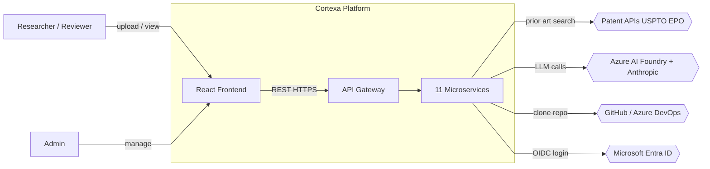
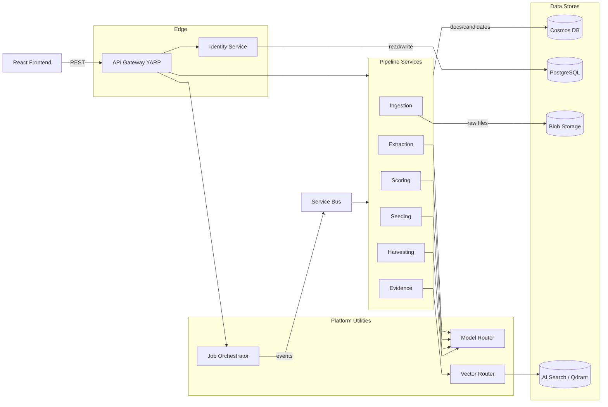
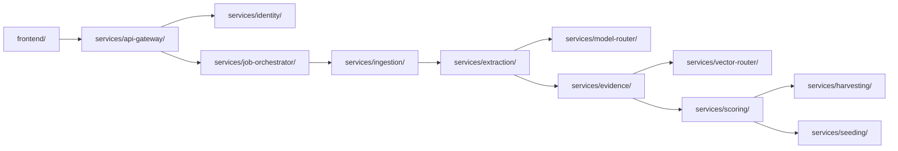
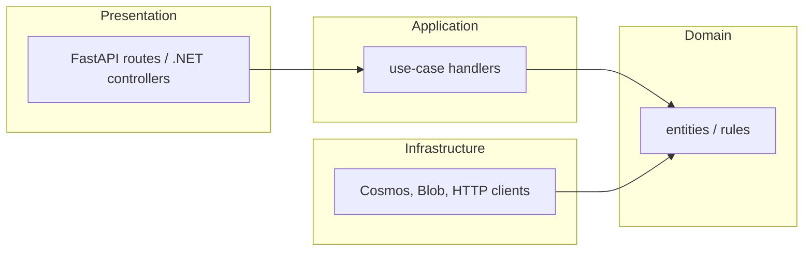
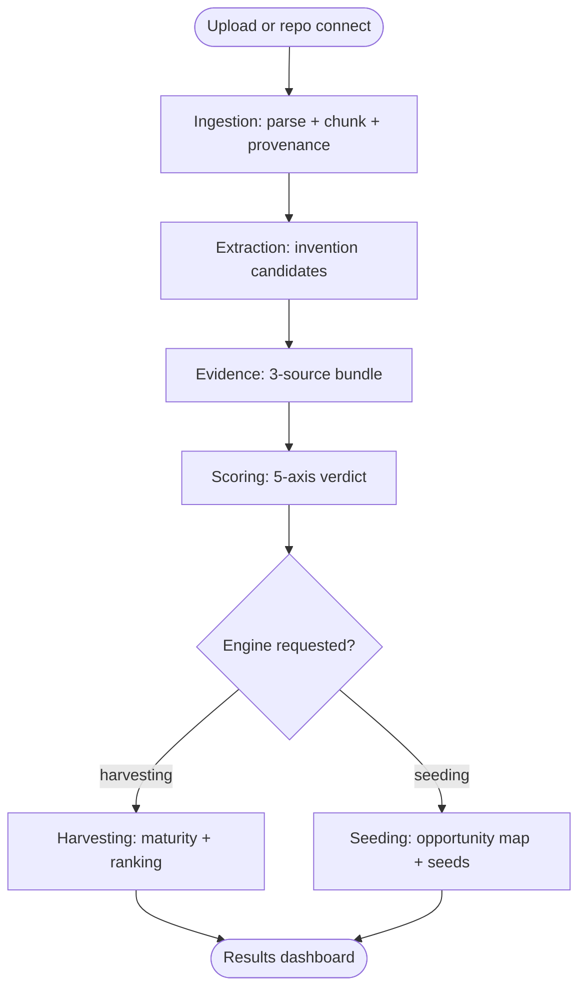
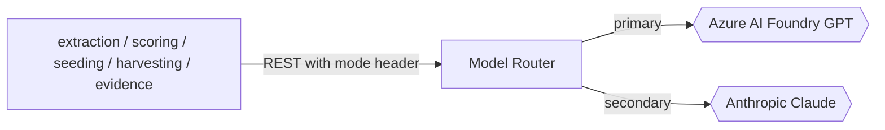
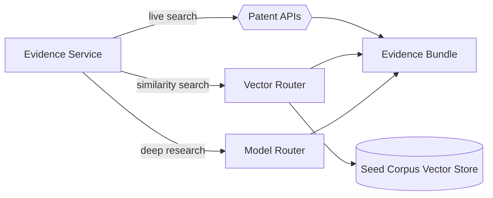
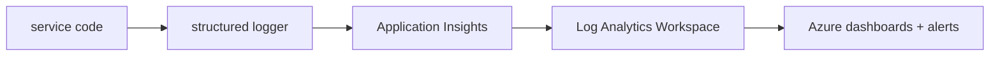
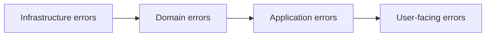
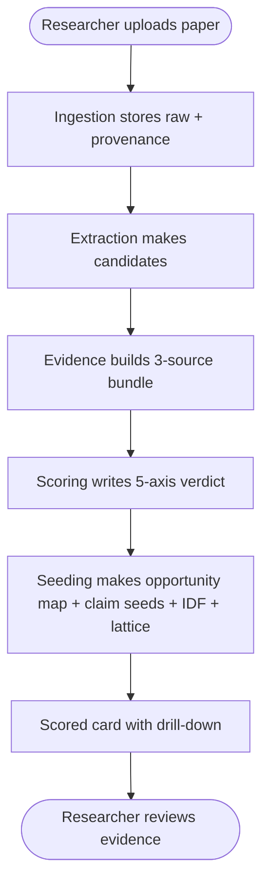

# Cortexa — System Architecture

| Field          | Value                                  |
| -------------- | -------------------------------------- |
| Title          | Cortexa System Architecture           |
| Version        | 0.1.15                                  |
| Date           | 2026-06-15                             |
| Status         | Approved                                  |
| Author         | QWxwaGEgU2lsdmVyQmFjaw             |
| Owner          | Alpha                                  |
| Classification | Internal — Confidential                |

---

## Table of Contents

1. [Executive Summary](#1-executive-summary)
2. [System Context](#2-system-context)
3. [Container / Layer Diagram](#3-container--layer-diagram)
4. [Monorepo Code Topology](#4-monorepo-code-topology)
5. [Clean Architecture Layer Mapping](#5-clean-architecture-layer-mapping)
6. [Pipeline and Engine Architecture](#6-pipeline-and-engine-architecture)
7. [Model Router Architecture](#7-model-router-architecture)
8. [Vector Router and Evidence Triangulation](#8-vector-router-and-evidence-triangulation)
9. [Async Messaging and Job Orchestration](#9-async-messaging-and-job-orchestration)
10. [Data Storage Architecture](#10-data-storage-architecture)
11. [Authentication and Authorization](#11-authentication-and-authorization)
12. [Cloud Infrastructure](#12-cloud-infrastructure)
13. [Security Architecture](#13-security-architecture)
14. [Logging and Observability Architecture](#14-logging-and-observability-architecture)
15. [Provenance and Grounding](#15-provenance-and-grounding)
16. [Error Handling Architecture](#16-error-handling-architecture)
17. [Architecture Decision Records](#17-architecture-decision-records)
18. [Data Flow Diagrams](#18-data-flow-diagrams)
19. [Non-Functional Requirements Mapping](#19-non-functional-requirements-mapping)
- [Appendix A: Glossary](#appendix-a-glossary)
- [Appendix B: Reference Documents](#appendix-b-reference-documents)
- [Appendix C: Revision History](#appendix-c-revision-history)

---

## 1. Executive Summary

Cortexa reads raw research material that is not a patent yet — papers, thesis files, source code — and tells you where the patent opportunity is hiding. Two engines run on one shared pipeline. The Harvesting Engine finds patentable inventions already buried in an asset. The Seeding Engine proposes new patent opportunities from the same asset plus roadmap context.

The MVP scopes exactly these two engines. Every patentability score is backed by three independent evidence sources: a live patent office API, a pre-loaded patent seed corpus searched by vector similarity, and an LLM deep-research pass. Each score carries citations and a confidence band. An attorney can click any number and see where it came from.

The shape is 11 independent microservices in one monorepo, plus a React frontend and Terraform IaC. Services are Python FastAPI or C#/.NET 8, chosen per service. They talk only over network contracts — REST for interactive calls, Azure Service Bus for the batch pipeline. No service shares code with another. Everything runs on Azure Container Apps, provisioned entirely by Terraform.

### Key Architectural Principles

- Each service is a standalone codebase — own project file, Dockerfile, CI pipeline, test suite. No shared libraries.
- Services communicate only over versioned network contracts (REST + Service Bus). No code coupling.
- Every LLM verdict must cite retrieved evidence. No ungrounded score is allowed.
- Model and vector backends are swappable at runtime through router services. No redeploy to switch.
- Three-source evidence design degrades gracefully. If one source is down, the engine works on the rest and says which were used.
- All Azure resources are defined in Terraform. No manual resource creation.
- Config-driven and secrets-first. No hardcoded URLs, keys, or ports.

### Architecture Tier

**Tier 2: Production-grade MVP** — a small-team cloud platform deployed live to Azure for demo and early users, scoped to two engines with 2-3 roles. It is not yet a multi-tenant billing platform (Tier 3), and it is past a single-machine prototype (Tier 1).

### Why This Architecture Fits

The proposal demands 11 services that can be built, tested, and deployed in isolation by a team of 4 core plus 10 junior developers in one month. Independent services let parallel tracks run without blocking each other. Network-only contracts stop coupling drift when 14 people touch the repo at once.

The three-source evidence rule is the product's whole point — a defensible score, not a black-box number. That rule drives the evidence and vector-router design. The router pattern (model-router, vector-router) keeps the swap points in one place each, so changing GPT to Claude or Azure AI Search to Qdrant is a config change, not a code change across services.

---

## 2. System Context

Cortexa is used by researchers, reviewers, and admins. Researchers upload papers or connect a git repo and get back patentability verdicts. The system talks to four external groups: patent office APIs, two LLM providers, a git host, and Microsoft Entra ID for secondary login.

### External System Boundaries

| External System              | Protocol         | Data Exchanged                          | Security Concern                                              |
| ---------------------------- | ---------------- | --------------------------------------- | ------------------------------------------------------------ |
| USPTO Open Data Portal       | HTTPS REST       | Patent search queries, patent records   | API key in Key Vault; rate limits; no PII sent               |
| EPO OPS                      | HTTPS REST + OAuth | Patent search queries, patent records | OAuth token in Key Vault; weekly quota cap                   |
| Azure AI Foundry (GPT)       | HTTPS REST       | Prompts with asset text, completions    | Managed identity; do not log prompts with sensitive content  |
| Anthropic API (Claude)       | HTTPS REST       | Prompts with asset text, completions    | API key in Key Vault; same logging rule                      |
| GitHub / Azure DevOps        | HTTPS Git        | Repo clone, file contents               | Fine-grained PAT, read-only, stored in Key Vault             |
| Microsoft Entra ID           | OIDC / OAuth2    | Login assertions, profile claims        | Standard OIDC validation; map claims to internal roles       |

---

## 3. Container / Layer Diagram

The frontend talks only to the API Gateway. The gateway routes to the 11 services. Python services run the pipeline; C# services run gateway, identity, model-router, and job-orchestrator. Storage splits across Cosmos (documents, candidates, evidence), Postgres (identity), Blob (raw files), and a vector store reached only through vector-router.

### Container Responsibilities

| Container        | Responsibility                                            | Technology            | Dependencies                          |
| ---------------- | --------------------------------------------------------- | --------------------- | ------------------------------------- |
| api-gateway      | Auth enforcement, routing, request shaping for frontend   | C# .NET 8, YARP       | identity, all pipeline services       |
| identity         | JWT sessions, email/password, Entra ID, roles             | C# .NET 8             | PostgreSQL                            |
| ingestion        | Parse PDF/DOCX, clone repos, chunk, build provenance map  | Python FastAPI        | Blob, Cosmos, Service Bus             |
| extraction       | LLM invention-candidate extraction with source spans      | Python FastAPI        | model-router, Cosmos, Service Bus     |
| evidence         | Patent API search, LLM research, merge into Evidence Bundle | Python FastAPI      | vector-router, patent APIs, model-router, Cosmos |
| vector-router    | Vector / embedding adapter, AI Search primary, Qdrant secondary | Python FastAPI    | AI Search or Qdrant                   |
| scoring          | 5-axis patentability scoring, single or dual model        | Python FastAPI        | model-router, Cosmos, Service Bus     |
| harvesting       | Maturity classification, ranking, harvesting report       | Python FastAPI        | Cosmos, Service Bus                   |
| seeding          | Opportunity map, IDF, claim seeds, invention lattice      | Python FastAPI        | model-router, Cosmos, Service Bus     |
| job-orchestrator | Saga pipeline coordinator, batch state, fan-out, retries  | C# .NET 8             | Service Bus, Cosmos                   |
| model-router     | LLM adapter, GPT primary, Claude secondary, dual mode     | C# .NET 8             | Azure AI Foundry, Anthropic API       |
| frontend         | Upload, job progress, dashboards, evidence drill-down     | React, TS, Vite, Fluent UI v9 | api-gateway                   |

---

## 4. Monorepo Code Topology

The repo holds 13 standalone units — 11 services, the frontend, and the deploy folder. Nothing under `services/` depends on another folder's code. The arrows below are runtime network calls, not code dependencies.

### Dependency Rules

1. No service imports code from another service. Communication is REST or Service Bus only.
2. The frontend calls only the api-gateway. It never calls a pipeline service directly.
3. Pipeline services never call each other in-process. The job-orchestrator drives the order through Service Bus events.
4. All LLM calls go through model-router. No service calls Azure AI Foundry or Anthropic directly.
5. All vector and embedding calls go through vector-router. No service touches AI Search or Qdrant directly.
6. Terraform under `deploy/` is the only place Azure resources are defined.

### Dependency Matrix

| Module            | Calls (runtime)                          | Called By (runtime)                       |
| ----------------- | ---------------------------------------- | ----------------------------------------- |
| frontend          | api-gateway                              | none                                      |
| api-gateway       | identity, all services, job-orchestrator | frontend                                  |
| identity          | PostgreSQL                               | api-gateway, every service (token check)  |
| job-orchestrator  | Service Bus, Cosmos                      | api-gateway                               |
| model-router      | Azure AI Foundry, Anthropic              | extraction, evidence, scoring, seeding, harvesting |
| vector-router     | AI Search / Qdrant                       | evidence                                  |
| ingestion         | Blob, Cosmos, Service Bus, git hosts     | job-orchestrator (via events)             |
| extraction        | model-router, Cosmos, Service Bus        | job-orchestrator (via events)             |
| evidence          | vector-router, patent APIs, model-router | job-orchestrator (via events)             |
| scoring           | model-router, Cosmos, Service Bus        | job-orchestrator (via events)             |
| harvesting        | Cosmos, Service Bus                      | job-orchestrator (via events)             |
| seeding           | model-router, Cosmos, Service Bus        | job-orchestrator (via events)             |

---

## 5. Clean Architecture Layer Mapping

Each service follows Clean Architecture inside its own codebase. The diagram shows the layers within one service, not across services. Dependencies point inward toward the domain.

### Layer Descriptions

| Layer          | Module(s) per service                 | Responsibility                       | Dependency Direction        |
| -------------- | ------------------------------------- | ------------------------------------ | --------------------------- |
| Domain         | `domain/` (Python) / `Domain` (.NET)  | Core models, enums, value objects, interface contracts | depends on nothing |
| Application    | `application/` / `Application`        | Use-case handlers, DTOs, validators  | → Domain                    |
| Infrastructure | `infrastructure/` / `Infrastructure`  | Cosmos, Blob, Service Bus, HTTP clients | → Domain (via interfaces) |
| Presentation   | `api/` / `Api`                        | FastAPI routes or .NET controllers   | → Application               |

### Dependency Inversion per Stack

Python services use Protocol classes (structural typing) for repository and client interfaces in `domain/`, with concrete implementations in `infrastructure/`. Wiring happens in a small `container` module at startup. FastAPI dependency injection passes the wired instances into route handlers.

.NET services use C# interfaces in the Domain project and register implementations in the built-in DI container in `Program.cs`. Controllers and handlers receive interfaces through constructor injection.

---

## 6. Pipeline and Engine Architecture

Both engines share one pipeline. They split only at the reasoning stage after scoring. The orchestrator drives stage order through Service Bus events so a 100-document batch never blocks.

| Stage            | Service          | Owns                                                        | Talks To                       |
| ---------------- | ---------------- | ----------------------------------------------------------- | ------------------------------ |
| Ingestion        | ingestion        | Parse, normalize, chunk, provenance map, store raw          | Blob, Cosmos                   |
| Extraction       | extraction       | Pull Invention Candidates with source spans                 | model-router                   |
| Evidence         | evidence         | Three-source triangulation into Evidence Bundle             | vector-router, patent APIs, model-router |
| Scoring          | scoring          | 5-axis verdict, single or dual model, grounded citations    | model-router                   |
| Harvesting       | harvesting       | Maturity classification, ranking, harvesting report         | Cosmos                         |
| Seeding          | seeding          | Opportunity map, IDF, claim seeds, invention lattice        | model-router                   |

The split is data-driven. After scoring writes a verdict, the orchestrator publishes both a `harvesting.requested` and a `seeding.requested` event when the run asks for both engines, or just one when the run asks for one. The two engines never depend on each other.

### The 5 Scoring Axes

| Axis           | Question it answers                                  |
| -------------- | ---------------------------------------------------- |
| Novelty        | How different is this from prior art?                |
| Inventiveness  | Is the step non-obvious to a skilled person?         |
| Commercial     | Is there market value?                               |
| Strategic      | Does it fit a defensible IP position?                |
| Patentability  | Overall likelihood a patent can be granted           |

Each axis carries a 0-100 sub-score, a confidence band, and citations to the Evidence Bundle. The composite Patentability score never appears without its evidence links.

---

## 7. Model Router Architecture

model-router is the single point for every LLM call. Primary is Azure AI Foundry (latest GPT). Secondary is Anthropic Claude. Callers pick mode per request through a header or config — single GPT, single Claude, or dual adversarial. No caller talks to a provider directly.

| Mode             | Behavior                                                                 |
| ---------------- | ------------------------------------------------------------------------ |
| single-primary   | Call GPT only. Default.                                                  |
| single-secondary | Call Claude only.                                                        |
| dual-adversarial | Call both, return both results plus an agreement flag. Optional.         |

The router enforces the grounding rule. A scoring or verdict request must include retrieved evidence. The router rejects a verdict request with no evidence reference. Every response carries the citation set used.

Provider selection sits behind an adapter. Adding a third provider later is a new adapter plus a config entry, with no change to callers. This is the future-integration rule from proposal §11 — the router is a platform utility, not a patent-only component.

---

## 8. Vector Router and Evidence Triangulation

vector-router is the single point for vector and embedding work. Azure AI Search is primary. Qdrant self-hosted on Container Apps is secondary. Switching backends is a config change in vector-router only.

Evidence triangulation merges three independent sources per candidate into one Evidence Bundle. The three run in parallel. If any source fails or times out, the bundle records which sources contributed and continues on the rest.

| Source             | Provider                          | Reached Via      | Fallback behavior                         |
| ------------------ | --------------------------------- | ---------------- | ----------------------------------------- |
| Live patent API    | USPTO Open Data Portal, EPO OPS   | evidence service direct adapter | Mark source unavailable, drop its hits |
| Seed corpus        | Pre-loaded patents in vector store | vector-router    | Mark source unavailable                   |
| LLM deep research  | Azure AI Foundry                  | model-router     | Mark source unavailable                   |

The bundle holds merged hits, dedup, per-claim citations, a flag per source showing whether it contributed, and a confidence band. This bundle is the audit trail that makes the score defensible.

---

## 9. Async Messaging and Job Orchestration

The job-orchestrator runs a saga per batch. It publishes stage events to Service Bus and consumes completion events to drive the next stage. Pipeline services consume their input topic and publish their output topic. This decouples stages and lets Container Apps autoscale each service on queue depth with KEDA.

| Topic / Queue             | Published By     | Consumed By      |
| ------------------------- | ---------------- | ---------------- |
| `ingestion.requested`     | job-orchestrator | ingestion        |
| `ingestion.completed`     | ingestion        | job-orchestrator |
| `extraction.requested`    | job-orchestrator | extraction       |
| `extraction.completed`    | extraction       | job-orchestrator |
| `evidence.requested`      | job-orchestrator | evidence         |
| `evidence.completed`      | evidence         | job-orchestrator |
| `scoring.requested`       | job-orchestrator | scoring          |
| `scoring.completed`       | scoring          | job-orchestrator |
| `harvesting.requested`    | job-orchestrator | harvesting       |
| `seeding.requested`       | job-orchestrator | seeding          |
| `engine.completed`        | harvesting, seeding | job-orchestrator |

The saga tracks per-document and per-batch state in Cosmos. On a stage failure it retries with backoff, and on exhausted retries it marks that document failed and continues the batch. Status is reported back to the frontend through the gateway.

---

## 10. Data Storage Architecture

Four stores, each with one clear job. Collections and containers are namespaced per engine so future modules do not collide.

| Store            | Holds                                                    | Why this store                                  |
| ---------------- | -------------------------------------------------------- | ----------------------------------------------- |
| Blob Storage     | Raw uploaded files, cloned repo snapshots                | Cheap large-object storage                      |
| Cosmos DB (NoSQL)| Documents, chunks, provenance maps, invention candidates, evidence bundles, verdicts, reports, harvesting results, batch saga state | Flexible schema, scales for 100+ doc batches |
| PostgreSQL       | Users, roles, sessions, refresh tokens                   | Relational integrity for identity               |
| Vector store     | Seed corpus embeddings (AI Search primary, Qdrant secondary) | Vector similarity search                     |

Cosmos partition keys are per-batch for pipeline data so a batch reads and writes stay in one logical partition. Identity data never sits in Cosmos — it stays in Postgres, owned only by the identity service.

---

## 11. Authentication and Authorization

identity is a custom service with its own Postgres database. It issues JWT access tokens and refresh tokens. Primary login is email/password. Secondary is Microsoft Entra ID through OIDC. Three roles: Researcher, Reviewer, Admin.

The api-gateway validates the JWT on every request and enforces role rules before routing. Pipeline services trust the gateway and re-check the token signature and role claim for defense in depth. Roles and claims are extensible — adding a role later does not break existing tokens.

| Role        | Can do                                                        |
| ----------- | ------------------------------------------------------------- |
| Researcher  | Upload, connect repo, run engines, view own results, export   |
| Reviewer    | Everything a Researcher can, plus view all results            |
| Admin       | Everything, plus user management and model-mode config        |

---

## 12. Cloud Infrastructure

Everything runs on Azure, defined in Terraform under `deploy/`. Two environments, dev and prod, from the same code with different config. Dev uses minimal SKUs and scale-to-zero to keep credit spend low. See the Deployment Design doc for the full module breakdown and CI/CD design.

| Concern              | Azure Service                                   |
| -------------------- | ----------------------------------------------- |
| Container hosting    | Azure Container Apps, one app per service, KEDA autoscale |
| Frontend hosting     | Azure Static Web Apps (App Service fallback)    |
| LLM primary          | Azure AI Foundry (latest GPT)                   |
| LLM secondary        | Anthropic API via model-router                  |
| Vector search        | Azure AI Search primary, Qdrant secondary       |
| Relational DB        | Azure Database for PostgreSQL Flexible Server   |
| Document store       | Azure Cosmos DB (NoSQL)                          |
| Raw files            | Azure Blob Storage                              |
| Async messaging      | Azure Service Bus (Standard dev, Premium prod)  |
| Secrets              | Azure Key Vault                                 |
| Container registry   | Azure Container Registry                        |
| Monitoring           | Application Insights + Log Analytics Workspace  |

---

## 13. Security Architecture

### Threat Model

| Threat                                   | Impact | Likelihood | Mitigation                                                       |
| ---------------------------------------- | ------ | ---------- | ---------------------------------------------------------------- |
| Stolen JWT used to access others' data   | High   | Med        | Short access-token life, refresh rotation, role checks at gateway and service |
| Secret leaked in logs or responses       | High   | Med        | Key Vault for all secrets, redaction in logging, never return secrets |
| Prompt injection from uploaded documents | Med    | High       | Treat document text as untrusted, no tool execution from model output, grounded-only verdicts |
| Patent API key abuse or quota exhaustion | Med    | Med        | Key in Key Vault, per-source rate limiting, source fallback      |
| Malicious file upload (parser exploit)   | High   | Med        | File type allowlist, size cap, parse in isolated service, no shell-out |
| Repo clone of attacker-controlled repo   | Med    | Med        | Read-only PAT, clone depth limit, size cap, no build/run of cloned code |

### OWASP Top 10 Mitigations

| OWASP Category                       | Mitigation in Cortexa                                              |
| ------------------------------------ | ------------------------------------------------------------------- |
| A01: Broken Access Control           | Role checks at gateway and re-checked per service; default deny      |
| A02: Cryptographic Failures          | TLS everywhere, secrets in Key Vault, password hashing with a strong KDF |
| A03: Injection                       | Parameterized Postgres queries, input validation, untrusted-text handling for LLM |
| A04: Insecure Design                 | Grounding rule, source fallback, namespaced data per engine          |
| A05: Security Misconfiguration       | Terraform-only resources, no public Cosmos/Postgres, least-privilege managed identities |
| A06: Vulnerable Components           | Dependency audit in CI (`pip-audit`, `dotnet list package --vulnerable`, `npm audit`) |
| A07: Identification and Auth Failures| JWT with rotation, lockout on repeated failures, Entra ID option     |
| A08: Software and Data Integrity     | Signed images in ACR, pinned dependencies, provenance map for data    |
| A09: Logging and Monitoring Failures | Structured logs to App Insights, alerts on auth failures and errors  |
| A10: SSRF                            | Outbound allowlist for patent APIs and LLM hosts; repo clone validation |

### Secrets Handling

All secrets live in Key Vault. Services read them through managed identity at startup. Logs never contain a full secret — at most a fingerprint (`sha256:<first-8-hex>`). Patent and LLM prompts that may carry sensitive asset text are not logged at INFO or below.

---

## 14. Logging and Observability Architecture

Every service writes structured JSON logs and traces to Application Insights, backed by a Log Analytics Workspace. A correlation ID flows from the gateway through every Service Bus message so one batch run can be traced end to end.

### Log Levels and Usage

| Level | Usage                                       | Example                                      |
| ----- | ------------------------------------------- | -------------------------------------------- |
| ERROR | A request or stage failed and could not recover | Scoring failed after retries for a document |
| WARN  | Recoverable problem or degraded path         | Patent API timed out, falling back to 2 sources |
| INFO  | Normal lifecycle events                      | Batch started, stage completed, document scored |
| DEBUG | Detail for diagnosing in dev                 | Chunk counts, candidate counts per document  |
| TRACE | Very fine detail, dev only                   | Per-chunk timing                             |

Health endpoints (`/health/live`, `/health/ready`) on each service feed Container Apps probes. Alerts fire on error-rate spikes, auth-failure spikes, and Service Bus dead-letter growth.

---

## 15. Provenance and Grounding

Provenance is a product feature, not just a log. Each invention candidate links back to the exact source — paragraph in a paper or file and line in code. Each verdict links to the Evidence Bundle, and each evidence item links to its source citation. A reviewer can drill from a score to the exact sentence that supports it in seconds.

The grounding rule is enforced in model-router: a verdict request without an evidence reference is rejected. This stops the LLM from inventing novelty. When dual mode is on, disagreement between GPT and Claude is shown, not hidden.

---

## 16. Error Handling Architecture

### Error Propagation Strategy

### Error Type Strategy

| Module / Stack       | Error Type / Pattern                          | Rationale                                  |
| -------------------- | --------------------------------------------- | ------------------------------------------ |
| Python services      | Typed exception hierarchy + Result-style return for expected failures | Clear separation of bugs vs expected outcomes |
| .NET services        | Result object for expected outcomes, exceptions for faults | Avoids control flow by exception           |
| Cross-service        | Standard error envelope over REST; dead-letter on Service Bus | Uniform handling at gateway and orchestrator |

### Recovery Strategies

| Error Category                  | Recovery Action                                            |
| ------------------------------- | ---------------------------------------------------------- |
| Patent API down or rate-limited | Drop that source, mark unavailable, continue on the rest   |
| LLM call failure                | Retry with backoff; on exhaustion, fail that document only  |
| Service Bus stage failure       | Retry with backoff; dead-letter after max attempts          |
| Parse failure on one document   | Mark document failed, continue the batch                    |
| Auth failure                    | Reject with 401/403, log, no retry                          |

---

## 17. Architecture Decision Records

### ADR-001: Use independent microservices over a modular monolith

| Field  | Value      |
| ------ | ---------- |
| Status | Accepted   |
| Date   | 2026-06-13 |

**Context:** 14 developers must build, test, and deploy parts in isolation within one month, and the proposal requires it.

**Decision:** 11 standalone services in a monorepo, communicating only over network contracts.

**Rejected Alternative:** A modular monolith. Simpler to deploy but forces shared build and coupling, which blocks parallel work across 14 people.

**Consequences:** More moving parts and more deploy pipelines. Pays off in parallel velocity and clean future-module reuse.

### ADR-002: Use router services for LLM and vector backends

| Field  | Value      |
| ------ | ---------- |
| Status | Accepted   |
| Date   | 2026-06-13 |

**Context:** The product must switch GPT/Claude and AI Search/Qdrant at runtime without code changes elsewhere.

**Decision:** A model-router and a vector-router service, each the single swap point.

**Rejected Alternative:** Each service calls providers directly. Spreads the swap logic and provider keys across the codebase.

**Consequences:** Two extra network hops. Worth it for one swap point per concern and reusable platform utilities.

### ADR-003: Use Azure Service Bus saga for batch orchestration

| Field  | Value      |
| ------ | ---------- |
| Status | Accepted   |
| Date   | 2026-06-13 |

**Context:** 100+ document batches must not block, and stages must scale independently.

**Decision:** A saga in job-orchestrator driving stages through Service Bus topics, with KEDA autoscale on queue depth.

**Rejected Alternative:** Synchronous chained REST calls. Simple but blocks on the slowest stage and does not scale per stage.

**Consequences:** Eventual consistency and more failure modes to handle. Gives throughput and per-stage scaling.

### ADR-004: Use Cosmos DB for pipeline data, PostgreSQL for identity

| Field  | Value      |
| ------ | ---------- |
| Status | Accepted   |
| Date   | 2026-06-13 |

**Context:** Pipeline data is flexible and high-volume; identity needs relational integrity.

**Decision:** Cosmos for documents/candidates/evidence/verdicts, Postgres for users/roles/sessions.

**Rejected Alternative:** One store for both. Cosmos weakens relational identity guarantees; Postgres alone scales worse for batch document churn.

**Consequences:** Two database technologies to operate. Each fits its job.

### ADR-005: Maintain both GitHub Actions and Azure Pipelines

| Field  | Value      |
| ------ | ---------- |
| Status | Accepted   |
| Date   | 2026-06-13 |

**Context:** Repo location may move between GitHub and Azure DevOps; the proposal asks for both.

**Decision:** Keep `ci.yml` and `cd.yml` for both platforms in sync, with the same logic.

**Rejected Alternative:** Pick one CI platform. Lower maintenance but a hard switch later if the repo moves.

**Consequences:** Duplicate pipeline maintenance. Removes lock-in risk during the POC.

### ADR-006: Enforce grounding in model-router, not in each caller

| Field  | Value      |
| ------ | ---------- |
| Status | Accepted   |
| Date   | 2026-06-13 |

**Context:** Every verdict must cite evidence, and the rule must not be skippable.

**Decision:** model-router rejects a verdict request that has no evidence reference.

**Rejected Alternative:** Trust each caller to attach evidence. One bug means an ungrounded score ships.

**Consequences:** Callers must always pass evidence. The rule holds in one place.

---

## 18. Data Flow Diagrams

### Seeding Demo Flow

---

## 19. Non-Functional Requirements Mapping

### Performance

| Requirement                  | Target                         | Architectural Mechanism                          |
| ---------------------------- | ------------------------------ | ------------------------------------------------ |
| Single-paper demo turnaround | Result in a few minutes        | Parallel evidence sources, async stages          |
| 100-document batch completes | Finishes on Azure without manual intervention | Service Bus saga, KEDA autoscale, capped concurrency |

### Reliability

| Requirement                  | Target                         | Architectural Mechanism                          |
| ---------------------------- | ------------------------------ | ------------------------------------------------ |
| One source down does not fail a run | Run completes on remaining sources | Three-source fallback in evidence service    |
| One bad document does not fail a batch | Batch continues             | Per-document retry then mark-failed in saga      |

### Scalability

| Requirement                  | Target                         | Architectural Mechanism                          |
| ---------------------------- | ------------------------------ | ------------------------------------------------ |
| Scale stages independently   | Heavy stages scale alone       | One Container App per service, queue-depth autoscale |
| Add a new engine later       | No rewrite of existing stages  | Saga pattern + new event topics                  |

### Security

| Requirement                  | Target                         | Architectural Mechanism                          |
| ---------------------------- | ------------------------------ | ------------------------------------------------ |
| No secret in code or logs    | Zero secrets in repo or logs   | Key Vault + managed identity + redaction         |
| Access by role               | Default deny                   | JWT + role checks at gateway and service         |

### Maintainability

| Requirement                  | Target                         | Architectural Mechanism                          |
| ---------------------------- | ------------------------------ | ------------------------------------------------ |
| Change a service in isolation| No cross-service rebuild       | Standalone codebases, network-only contracts     |
| Swap a provider              | Config change only             | model-router and vector-router swap points       |

### Cost

| Requirement                  | Target                         | Architectural Mechanism                          |
| ---------------------------- | ------------------------------ | ------------------------------------------------ |
| Keep dev spend low           | Minimal credit burn in dev     | Scale-to-zero Container Apps, basic SKUs, budget alert week 1 |

---

## Appendix A: Glossary

| Term               | Definition                                                             |
| ------------------ | ---------------------------------------------------------------------- |
| Invention Candidate| A structured idea pulled from an asset: claim, problem, mechanism, source span, tech field |
| Evidence Bundle    | Merged three-source prior-art evidence per candidate, with citations and confidence |
| Seed corpus        | Pre-loaded curated patents embedded in the vector store for offline similarity |
| Maturity           | Harvesting classification: Mature (ready to draft) vs Emerging signal (needs engineering) |
| Claim seed         | A seed for a future claim, not a full claim                            |
| Invention lattice  | A patent family roadmap: core → continuation → platform → system        |
| Provenance map     | Links from extracted content back to the exact source span             |
| Grounding          | The rule that every LLM verdict must cite retrieved evidence            |

## Appendix B: Reference Documents

| Document             | Location                                                              | Purpose                          |
| -------------------- | -------------------------------------------------------------------- | -------------------------------- |
| Low Level Design     | `.notes/informations/Architectures/Cortexa_LowLevelDesign.md`       | Types, schemas, state machines   |
| Implementation Guide | `.notes/informations/Architectures/Cortexa_ImplementationGuide.md`  | Build order and steps            |
| Project Plan         | `.notes/informations/Architectures/Cortexa_ProjectPlan.md`          | Phases, backlog, timeline        |
| Deployment Design    | `.notes/informations/Architectures/Cortexa_DeploymentDesign.md`     | Azure IaC and CI/CD design       |
| Proposal             | `.notes/informations/Problem_Statements/Cortexa_Proposal.md`        | Source requirements              |

## Appendix C: Revision History

| Version | Date       | Author                     | Changes        |
| ------- | ---------- | -------------------------- | -------------- |
| 0.1.0   | 2026-06-13 | QWxwaGEgU2lsdmVyQmFjaw | Initial draft  |

---

**End of Document** — Cortexa System Architecture v0.1.0
