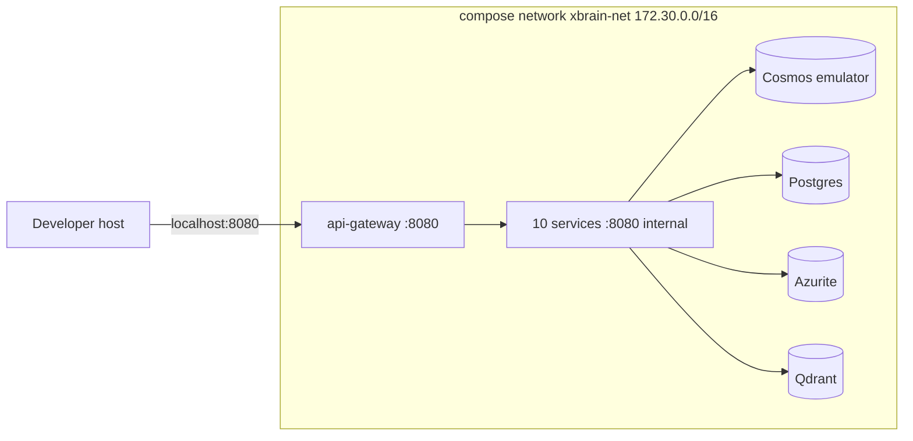

# Cortexa — Deployment Design

| Field      | Value                          |
| ---------- | ------------------------------ |
| Status     | Approved                          |
| Author     | QWxwaGEgU2lsdmVyQmFjaw          |
| Date       | 2026-06-15                     |
| Supersedes | N/A                            |

---

## 1. Goals & Non-Goals

### Goals

- Reproducible two-mode deployment from one repo: local for dev, Azure for dev and prod.
- All Azure resources created by Terraform. No manual resource creation.
- Idempotent, re-runnable deploys. Re-running changes nothing if nothing changed.
- One environment codebase for dev and prod, with config differences only (SKUs, secrets).
- Per-service deploy. A change to one service deploys only that service.

### Non-Goals

- No Kubernetes. Container Apps only.
- No multi-region or CDN in this version.
- No live cloud auth during the design phase.
- Prod is reserved for the demo, not for daily dev.

---

## 2. Two-Mode Strategy — Comparison

| Aspect            | Local Mode                       | Cloud Mode (Azure)               |
| ----------------- | -------------------------------- | -------------------------------- |
| Runtime           | Docker Compose                   | Azure Container Apps             |
| Document store    | Cosmos DB emulator               | Azure Cosmos DB                  |
| Relational DB     | Local Postgres container         | Azure PostgreSQL Flexible        |
| Object storage    | Azurite                          | Azure Blob Storage               |
| Messaging         | Local queue shim / SB emulator   | Azure Service Bus                |
| Vector store      | Qdrant container                 | Azure AI Search (Qdrant fallback)|
| LLM               | Live AI Foundry + Anthropic (keys) | Live AI Foundry + Anthropic    |
| Patent APIs       | Live USPTO + EPO (free keys)     | Live USPTO + EPO                 |
| Secrets           | `.env` file (gitignored)         | Key Vault + managed identity     |
| CI/CD trigger     | Manual `docker compose up`       | PR to qa (gated) + tag for prod  |
| Network exposure  | localhost ports                  | Public frontend + private backend, TLS |
| Audience          | Developer laptop / dev container | Dev (integration), Prod (demo)   |

**Shared:** both modes build from the same per-service Dockerfiles.

---

## 3. Local Mode — Architecture

### 3.1 Network Diagram



### 3.2 Service Inventory

| Service          | Image / Runtime      | Internal Port | Exposed | Volumes          | Notes                       |
| ---------------- | -------------------- | ------------- | ------- | ---------------- | --------------------------- |
| api-gateway      | local .NET build     | 8080          | Y       | none             | Only exposed service        |
| 10 services      | local builds         | 8080          | N       | none             | Reached via gateway         |
| cosmos-emulator  | Cosmos emulator      | 8081          | N       | data volume      | Local document store        |
| postgres         | postgres:16          | 5432          | N       | data volume      | Identity DB                 |
| azurite          | Azurite              | 10000-10002   | N       | data volume      | Blob emulator               |
| qdrant           | qdrant/qdrant        | 6333          | N       | data volume      | Vector store local          |

### 3.3 Port / Network Matrix

| Source       | Destination      | Port    | Protocol | Visibility |
| ------------ | ---------------- | ------- | -------- | ---------- |
| host         | api-gateway      | 8080    | http     | host       |
| api-gateway  | each service     | 8080    | http     | internal   |
| services     | cosmos-emulator  | 8081    | https    | internal   |
| identity     | postgres         | 5432    | tcp      | internal   |
| services     | azurite          | 10000   | http     | internal   |
| vector-router| qdrant           | 6333    | http     | internal   |

**Host firewall rules:** allow 8080/tcp only.

---

## 4. Local Mode — Implementation Language Recommendation

| Criterion     | Bash       | Python     | Make       |
| ------------- | ---------- | ---------- | ---------- |
| Lines of code | Low        | Med        | Low        |
| Bootstrap     | Built-in   | Needs venv | Built-in   |
| Debuggability | Med        | High       | Low        |
| Portability   | High (Linux dev container) | High | High |

**Recommendation:** a Bash `deploy.sh` orchestrator that calls `docker compose`, seeds the corpus, and runs health checks. No stateful stub service is needed because all external services (Cosmos, Blob, SB, vector) have local emulators or containers, and LLM/patent APIs are called live with dev keys.

---

## 5. Local Mode — Idempotency Algorithm

**State file:** `deploy/local/.deploy.state` (JSON, mode 600) — tracks the last built git SHA and per-service image digests.

```
# pseudocode
1. acquire lock
2. ensure prerequisites (docker, compose)
3. resolve current git SHA
4. compute changed service folders vs last deployed SHA
5. rebuild images only for changed services
6. compose up -d (recreate only changed)
7. wait for health checks on all services
8. write new state (SHA + digests)
```

**Flags:** `--force-rebuild` rebuilds all; `--dry-run` prints the plan only.

---

## 6. Local Mode — Repository / Credential Access Setup

The ingestion service clones git repos. Local dev uses a fine-grained PAT with read-only Contents scope, stored in `deploy/local/.env` (gitignored).

- **Rotation policy:** rotate the dev PAT every 90 days; revoke the old one immediately on rotation.
- **Secret handling:** never log a full secret. Log a fingerprint only (`sha256:<first-8-hex>`).

Local `.env` also holds dev keys for AI Foundry, Anthropic, USPTO, and EPO. These are personal dev keys, never committed.

---

## 7. Local Mode — Compose / Orchestration Breakdown

| Compose File              | Service Defined        | Depends On        | Healthcheck            |
| ------------------------- | ---------------------- | ----------------- | ---------------------- |
| `compose.infra.yml`       | cosmos, postgres, azurite, qdrant | none      | TCP / readiness probe  |
| `compose.platform.yml`    | gateway, identity, model-router, vector-router | infra | GET /health/ready  |
| `compose.pipeline.yml`    | ingestion, extraction, evidence, scoring, harvesting, seeding | platform | GET /health/ready |
| `compose.orchestrator.yml`| job-orchestrator       | pipeline          | GET /health/ready      |

Environment-variable wiring: connection strings point at emulator hostnames (`cosmos-emulator`, `postgres`, `azurite`, `qdrant`). Inter-service URLs use compose service names. A one-shot builder container builds the frontend bundle, which the gateway serves in local mode.

---

## 8. Local Mode — Third-Party Stub Design

None needed. All external dependencies have local emulators (Cosmos, Blob via Azurite, vector via Qdrant) or are called live with free dev keys (LLM, patent APIs). Messaging uses the Service Bus emulator or a local queue shim; the consumer loop code is identical to cloud.

---

## 9. Cloud Mode — Infrastructure-as-Code Module Breakdown

```
deploy/
├── modules/
│   ├── container-apps/
│   ├── cosmos-db/
│   ├── service-bus/
│   ├── ai-foundry/
│   ├── ai-search/
│   ├── blob-storage/
│   ├── key-vault/
│   ├── container-registry/
│   ├── postgresql/
│   ├── monitoring/
│   └── static-web-app/
├── environments/
│   ├── dev/
│   └── prod/
├── backend.tf
├── versions.tf
└── main.tf
```

| Module             | Inputs                                  | Outputs                          | Notes                          |
| ------------------ | --------------------------------------- | -------------------------------- | ------------------------------ |
| key-vault          | name, tenant_id, access policies        | vault_uri                        | Holds all secrets              |
| container-registry | name, sku                               | login_server                     | Stores service images          |
| monitoring         | workspace name, retention               | app_insights_key, law_id         | Logs, traces, alerts           |
| blob-storage       | account name, containers                | account_name, container_uris     | Raw files; also TF state account (bootstrapped separately) |
| cosmos-db          | account name, db, containers, RU/s      | endpoint, keys (to KV)           | Pipeline data                  |
| postgresql         | server name, sku, db, admin             | host, conn (to KV)               | Identity DB                    |
| service-bus        | namespace, sku, topics/queues           | namespace, conn (to KV)          | Standard dev, Premium prod     |
| ai-foundry         | account, GPT deployment, capacity       | endpoint, deployment_name        | Primary LLM                    |
| ai-search          | service name, sku, index                | endpoint, key (to KV)            | Primary vector store           |
| container-apps     | env name, per-service app specs, scaling| app FQDNs, identities            | One app per service, KEDA      |
| static-web-app     | name, sku                               | default_hostname                 | Frontend hosting               |

- **State backend:** Terraform state in an Azure Blob container. The state storage account and container are bootstrapped manually once (Open item 7), not IaC-managed.
- **Validation gates:** `terraform fmt -check`, `terraform validate`, `tflint`, and `tfsec` run in CI. `terraform plan` runs with read-only creds before any apply.

---

## 10. Cloud Mode — CI/CD Workflow Design

Both GitHub Actions and Azure Pipelines hold the same logic in `ci.yml`, `cd.yml`, and `release.yml`. The two formats are kept in sync so the repo can move between GitHub and Azure DevOps.

### 10.1 CI Workflow (on PR dev → qa)

| Job              | Purpose                                                  |
| ---------------- | -------------------------------------------------------- |
| format           | `ruff format --check` / `dotnet format --verify` / eslint |
| lint             | `ruff check` / analyzers / eslint                        |
| test             | `pytest` / `dotnet test` / `vitest`                      |
| audit            | `pip-audit` / `dotnet list package --vulnerable` / `npm audit` |
| build            | `docker build` per changed service (push: false)         |
| deny (IaC)       | `terraform validate`, `tflint`, `tfsec` on `deploy/`     |

No credentials, no cloud access. External deps mocked. Branch protection: CI must be green before merge. CI runs even before dev resources exist.

### 10.2 Deploy Workflow (on qa PR, gated)

| Job              | Purpose                                                  |
| ---------------- | -------------------------------------------------------- |
| tf-plan          | `terraform plan` for dev                                 |
| approval         | Manual approval gate before apply                        |
| tf-apply         | `terraform apply` for dev                                |
| build-push       | Build and push changed service images to ACR             |
| deploy           | Update each changed Container App to the new image       |
| smoke            | Hit health endpoints; fail the run if any is unhealthy   |

Auth uses OIDC workload identity federation — no static keys in CI. The apply and deploy stages sit behind an environment protection rule. CD may fail until dev resources exist; that is expected and does not block CI.

### 10.3 CI/CD Modularity (swap path)

Build and deploy steps live in a reusable composite action (GitHub) and a template (Azure Pipelines), so the CI platform can be swapped without rewriting each service pipeline. A `release.yml` triggers only on a `v*` tag, runs the same plan → approve → apply → deploy → smoke flow against prod, behind its own approval gate. Swap details live in `deploy/cloud/runbooks/ci-swap.md`.

---

## 11. Cloud Mode — Manual Setup Inventory

| Task                          | Why Not Automated                          | Manual Step                                  |
| ----------------------------- | ------------------------------------------ | -------------------------------------------- |
| Subscription + budget         | Org-level, outside Terraform                | Confirm subscription id and budget cap        |
| TF state storage account      | Chicken-and-egg before any TF runs          | Create account + container once               |
| Workload identity federation  | Trust setup between CI and Azure            | Configure OIDC federation for the CI identity |
| Entra ID app registration     | Tenant-level config                         | Register app, set redirect URI, capture ids   |
| Secret values                 | Secrets must not be in code                 | Put API keys and PATs into Key Vault          |
| AI Foundry quota              | Quota request is a portal action            | Request GPT capacity for the deployment       |
| DNS / custom domain (if used) | Domain ownership                            | Point domain at the Static Web App            |

---

## 12. Folder Structure

```
deploy/
├── local/
│   ├── deploy.sh
│   ├── lib/
│   ├── compose/
│   │   ├── compose.infra.yml
│   │   ├── compose.platform.yml
│   │   ├── compose.pipeline.yml
│   │   └── compose.orchestrator.yml
│   └── env/.env.example
├── cloud/
│   ├── terraform/        (or top-level deploy/modules + environments)
│   ├── ci-cd/
│   └── runbooks/
└── shared/
    └── dockerfiles/      (per-service Dockerfiles shared by both modes)
```

Note: the proposal's `deploy/` layout (modules + environments + main.tf) is the source of truth for Terraform. The `cloud/` grouping above is a logical view; keep the flat `deploy/modules` and `deploy/environments` layout if the team prefers it.

---

## 14. Risks & Open Questions

### Risks

| Risk                                          | Likelihood | Impact | Mitigation                                  |
| --------------------------------------------- | ---------- | ------ | ------------------------------------------- |
| State bucket not bootstrapped before TF runs  | Med        | High   | Bootstrap script as the first IaC step       |
| Dev resources missing, CD fails               | High       | Med    | CI stays green without Azure; apply IaC first |
| LLM token cost spikes during load test        | Med        | High   | Cap concurrency, cache embeddings, budget alert |
| Service Bus dead-letter growth unnoticed      | Med        | Med    | Alert on dead-letter count                  |
| OIDC federation misconfigured                 | Med        | High   | Verify with a dry-run deploy early           |

### Design Decisions Logged

1. Use OIDC workload identity for CI auth, no static keys — resolved 2026-06-13.
2. Keep both GitHub Actions and Azure Pipelines in sync — resolved 2026-06-13 (proposal §9).
3. Prod applied late, reserved for the demo — resolved 2026-06-13 (proposal §8).

### Residual Open Risks

| Open Risk                          | Likelihood | Impact | Owner / Path                       |
| ---------------------------------- | ---------- | ------ | ---------------------------------- |
| AI Foundry GPT quota insufficient  | Med        | High   | IaC owner / Open item 4            |
| Budget cap unknown at start        | Med        | High   | Alpha / Open item 4                |

---

## Appendix A: Environment Variable Reference

| Variable             | Purpose             | Local Value          | Cloud Value              |
| -------------------- | ------------------- | -------------------- | ------------------------ |
| COSMOS_ENDPOINT      | Document store      | emulator endpoint    | Cosmos endpoint          |
| SERVICEBUS_NAMESPACE | Messaging           | emulator / shim      | SB namespace             |
| BLOB_ENDPOINT        | Raw files           | Azurite endpoint     | Blob endpoint            |
| VECTOR_BACKEND       | Vector backend      | `qdrant`             | `ai_search`              |
| FOUNDRY_ENDPOINT     | LLM primary         | live dev endpoint    | AI Foundry endpoint      |
| ANTHROPIC_API_KEY    | LLM secondary       | dev key (.env)       | Key Vault                |
| USPTO_API_KEY        | Patent live lookup  | dev key (.env)       | Key Vault                |
| EPO_OAUTH_SECRET     | Patent international | dev key (.env)       | Key Vault                |
| GIT_CLONE_PAT        | Repo clone          | dev PAT (.env)       | Key Vault                |
| JWT_SIGNING_KEY      | Token signing       | dev key (.env)       | Key Vault                |

## Appendix B: Secret Rotation Policies

| Secret           | Cadence    | Procedure                                |
| ---------------- | ---------- | ---------------------------------------- |
| Git clone PAT    | 90 days    | Rotate, revoke old immediately            |
| LLM API keys     | 90 days    | Rotate in Key Vault, redeploy reads it    |
| Patent API keys  | As needed  | Re-register if quota or key changes       |
| JWT signing key  | 90 days    | Rotate with overlap window for old tokens |

---

**End of Document** — Cortexa Deployment Design
