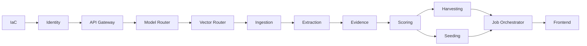

# Cortexa — Implementation Guide

| Field          | Value                                  |
| -------------- | -------------------------------------- |
| Title          | Cortexa Implementation Guide          |
| Version        | 0.1.15                                  |
| Date           | 2026-06-15                             |
| Status         | Draft                                  |
| Author         | QWxwaGEgU2lsdmVyQmFjaw             |
| Owner          | Alpha                                  |
| Classification | Internal — Confidential                |
| References     | [Architecture](./Cortexa_Architecture.md), [LLD](./Cortexa_LowLevelDesign.md), [Project Plan](./Cortexa_ProjectPlan.md) |

---

## Table of Contents

1. [Document Header](#1-document-header)
2. [Prerequisites and Environment Setup](#2-prerequisites-and-environment-setup)
3. [Monorepo and Build System Setup](#3-monorepo-and-build-system-setup)
4. [Build Order](#4-build-order)
5. [Per-Service Implementation Instructions](#5-per-service-implementation-instructions)
6. [Containerization](#6-containerization)
7. [Reusable Code Patterns](#7-reusable-code-patterns)
8. [Integration Points Map](#8-integration-points-map)
9. [Deployment Pipeline](#9-deployment-pipeline)
10. [Common Issues and Troubleshooting](#10-common-issues-and-troubleshooting)
11. [Development Best Practices](#11-development-best-practices)
12. [Verification Checklist](#12-verification-checklist)
- [Appendix A: Glossary](#appendix-a-glossary)
- [Appendix B: Reference Documents](#appendix-b-reference-documents)

---

## 1. Document Header

> This Implementation Guide is the step-by-step playbook for building Cortexa from scratch.
>
> **How to use this guide:**
> - Follow the build order in section 4 — it matches proposal §10.
> - Code shown is pseudocode (this is a design doc). Developer agents write real Python, C#, and TypeScript from these steps and the LLD.
> - For the *why*, see the [Architecture](./Cortexa_Architecture.md). For exact types, see the [LLD](./Cortexa_LowLevelDesign.md). For phasing, see the [Project Plan](./Cortexa_ProjectPlan.md).
> - Each service section ends with a verification command.

---

## 2. Prerequisites and Environment Setup

### 2.1 Required Tools

| Tool             | Version    | Purpose                          | Install Command                              |
| ---------------- | ---------- | -------------------------------- | -------------------------------------------- |
| Python           | 3.14.x     | FastAPI services                 | `uv python install 3.14`                     |
| uv               | latest     | Python env + deps                | `curl -LsSf https://astral.sh/uv/install.sh \| sh` |
| .NET SDK         | 8.0.x      | C# services                      | `apt-get install dotnet-sdk-8.0`             |
| Node.js          | 24 LTS     | Frontend                         | via nvm                                      |
| pnpm             | latest     | Frontend deps                    | `npm i -g pnpm`                              |
| Docker           | latest     | Build and run service images     | distro package                               |
| Terraform        | 1.7+       | Azure IaC                        | HashiCorp apt repo                           |
| Azure CLI        | latest     | Azure auth and ops               | `curl -sL https://aka.ms/InstallAzureCLIDeb \| bash` |

### 2.2 System Requirements

| Requirement | Minimum         | Recommended       |
| ----------- | --------------- | ----------------- |
| OS          | Linux (dev container) | Linux remote (VSCode tunnel) |
| RAM         | 8 GB            | 16 GB             |
| Disk        | 20 GB           | 40 GB             |
| Network     | Outbound HTTPS to Azure, patent APIs, LLM hosts | same |

### 2.3 External Accounts and Keys

| Account / Key                 | Used By        | Setup                                                   |
| ----------------------------- | -------------- | ------------------------------------------------------- |
| Azure subscription            | all            | Confirm subscription id, budget cap, AI Foundry quota    |
| USPTO Open Data Portal key    | evidence       | Register free key at data.uspto.gov                     |
| EPO OPS OAuth key             | evidence       | Register free OAuth app at EPO OPS                      |
| Anthropic API key             | model-router   | Provision Claude key, store in Key Vault                 |
| GitHub / Azure DevOps PAT     | ingestion      | Fine-grained, read-only Contents, store in Key Vault     |
| Entra ID app registration     | identity       | Register app, set redirect URI, capture client id        |

All keys go into Key Vault. None are committed. Local dev uses a `.env` file listed in `.gitignore`.

### 2.4 Recommended IDE Setup

```json
{
  "recommendations": [
    "ms-python.python",
    "charliermarsh.ruff",
    "ms-dotnettools.csharp",
    "dbaeumer.vscode-eslint",
    "hashicorp.terraform"
  ]
}
```

### 2.5 Environment Verification Commands

```bash
python --version    # Expected: Python 3.14.x
dotnet --version    # Expected: 8.0.x
node --version      # Expected: v20.x
terraform version   # Expected: 1.7+
az --version        # Expected: azure-cli present
```

---

## 3. Monorepo and Build System Setup

### 3.1 Workspace Layout

The repo has no top-level solution that ties services together. Each service builds alone.

```bash
mkdir -p services frontend deploy/{modules,environments/dev,environments/prod}
mkdir -p .github/workflows azure-pipelines
```

### 3.2 Per-Service Project Files

| Service type | Project file       | Build              | Test                |
| ------------ | ------------------ | ------------------ | ------------------- |
| Python       | `pyproject.toml`   | `uv sync`          | `uv run pytest`     |
| .NET         | `*.csproj`         | `dotnet build`     | `dotnet test`       |
| Frontend     | `package.json`     | `pnpm build`       | `pnpm test`         |

### 3.3 Package Dependencies (per layer)

Python services pin in `pyproject.toml`:

```toml
[project]
requires-python = ">=3.14"
dependencies = [
  "fastapi",
  "uvicorn[standard]",
  "httpx",
  "pydantic",
  "azure-cosmos",
  "azure-servicebus",
  "azure-storage-blob",
  "azure-identity",
]
[tool.uv]
dev-dependencies = ["pytest", "pytest-asyncio", "ruff", "pip-audit"]
```

.NET services reference (per `.csproj`): `Yarp.ReverseProxy` (gateway only), `Azure.Messaging.ServiceBus`, `Microsoft.Azure.Cosmos`, `Azure.Identity`, `Microsoft.AspNetCore.Authentication.JwtBearer`, `Npgsql` (identity only).

Frontend `package.json`: `react`, `react-dom`, `@fluentui/react-components`, `vite`, `typescript`, `vitest`, `eslint`.

### 3.4 Global Config Files

- Python: shared `ruff.toml` rules copied (not imported) into each service.
- .NET: `.editorconfig` per service for analyzers.
- Frontend: `eslint.config.js`, `tsconfig.json`.

### 3.5 Verification

```bash
# in a Python service
uv sync && uv run ruff check .
# in a .NET service
dotnet build
# Expected: build succeeded, zero errors, zero warnings
```

---

## 4. Build Order

### 4.1 Dependency Graph



### 4.2 Build Order and Parallelism

This follows proposal §10. After contracts are frozen, three tracks run in parallel: IaC, backend services, and frontend.

| Wave   | Work                                         | Parallelizable?         | Prerequisite          |
| ------ | -------------------------------------------- | ----------------------- | --------------------- |
| Wave 1 | IaC core resources                           | IaC track runs alone    | None                  |
| Wave 2 | Identity, API Gateway                        | After IaC has Postgres + Container Apps | Wave 1 |
| Wave 3 | Model Router, Vector Router                  | Yes, both at once       | Wave 2                |
| Wave 4 | Ingestion → Extraction → Evidence            | Sequential by data dep  | Wave 3                |
| Wave 5 | Scoring → Harvesting + Seeding               | Harvesting and Seeding in parallel | Wave 4    |
| Wave 6 | Job Orchestrator                             | Needs all pipeline contracts | Wave 5           |
| Wave 7 | Frontend full build                          | Frontend track joins once contracts are stable | Wave 6 |

### 4.3 Build Verification at Each Wave

```bash
# Wave 1: terraform validate in deploy/environments/dev
terraform -chdir=deploy/environments/dev validate
# Wave 3: each router builds and its health endpoint responds
# Wave 6: full pipeline runs one document end to end in dev
```

---

## 5. Per-Service Implementation Instructions

### 5.1 IaC (First — every service needs Azure resources)

**Purpose:** define all Azure resources in Terraform.
**Spec reference:** Deployment Design §9.

#### 5.1.1 Directory Structure

```
deploy/
├── modules/{container-apps,cosmos-db,service-bus,ai-foundry,ai-search,blob-storage,key-vault,container-registry,postgresql,monitoring,static-web-app}/
├── environments/{dev,prod}/
└── main.tf
```

#### 5.1.2 Steps

1. Bootstrap the state backend storage account manually (one time, not IaC-managed).
2. Write `backend.tf` pointing at the Azure Blob state container.
3. Write each module with inputs, outputs, and SKU variables.
4. Write `environments/dev` with minimal SKUs and scale-to-zero; `environments/prod` with Premium Service Bus and higher SKUs.
5. Add a budget alert resource in week 1.

#### 5.1.3 Verification

```bash
terraform -chdir=deploy/environments/dev init
terraform -chdir=deploy/environments/dev plan
# Expected: plan shows all resources, zero errors
```

### 5.2 Identity Service (After IaC has Postgres)

**Purpose:** JWT auth, email/password, Entra ID, roles.
**Spec reference:** LLD §6.2, §11.1.

Steps: create the `.csproj`; add domain models (`User`, `RefreshToken`, `Role`); add `IUserRepository` and `Npgsql` implementation; add `AuthService` with password login, Entra OIDC login, token issue and refresh rotation; expose `/auth/login`, `/auth/entra`, `/auth/refresh`; add JWT signing config from Key Vault.

```
# pseudocode — login endpoint
POST /auth/login (email, password):
    result = auth_service.login_password(email, password)
    if result is error -> return 401 envelope
    return 200 envelope with token pair
```

Verification: `dotnet test` passes; a login returns a token whose signature validates.

### 5.3 API Gateway (After Identity)

**Purpose:** route, validate JWT, enforce roles, attach correlation id.
**Spec reference:** LLD §6.1.

Steps: create the YARP `.csproj`; add route config mapping `/api/{service}/*` to each service; add JWT validation middleware; add role-check middleware; add correlation-id middleware.

Verification: a request with no token returns 401; with a Researcher token to an Admin route returns 403; a valid route forwards.

### 5.4 Model Router (After Gateway)

**Purpose:** single LLM entry, GPT primary, Claude secondary, dual mode, grounding rule.
**Spec reference:** LLD §5.1.

Steps: create the `.csproj`; add `IModelProvider`; add `FoundryProvider` and `AnthropicProvider`; add `ModelRouter` with the grounding check and mode switch; expose `POST /complete` and `POST /complete/dual`.

```
# pseudocode — complete endpoint
POST /complete (ModelRequestDto):
    if request.is_verdict and no evidence_refs -> return 422 UNGROUNDED_VERDICT
    return router.run(request)
```

Verification: a verdict request with no evidence returns 422; a normal request returns a completion with citations.

### 5.5 Vector Router (Parallel with Model Router)

**Purpose:** single vector entry, AI Search primary, Qdrant secondary.
**Spec reference:** LLD §5.2.

Steps: create the FastAPI service; add `VectorBackend` Protocol; add `AiSearchBackend` and `QdrantBackend`; pick backend by `VECTOR_BACKEND` config; expose `POST /search`, `POST /upsert`, `POST /embed`.

Verification: search against a seeded index returns ranked hits; switching `VECTOR_BACKEND` needs no code change.

### 5.6 Ingestion Service (After routers)

**Purpose:** parse PDF/DOCX, clone repos, chunk, build provenance, store.
**Spec reference:** LLD §4.

Steps: add file parser (PDF/DOCX text only), repo cloner (read-only PAT, depth and size caps), chunker, provenance map builder; write raw to Blob and chunks to Cosmos; publish `ingestion.completed`.

Verification: uploading a sample PDF produces chunks with provenance spans and an `ingestion.completed` event.

### 5.7 Extraction Service (After Ingestion)

**Purpose:** pull Invention Candidates with source spans.
**Spec reference:** LLD §4, §9.

Steps: consume `extraction.requested`; build extraction prompt from chunks; call model-router; parse structured candidates; attach source spans; store; publish `extraction.completed`.

Verification: candidates carry claim, problem, mechanism, tech field, and a valid source span.

### 5.8 Evidence Service (After Extraction and Vector Router)

**Purpose:** three-source triangulation into an Evidence Bundle.
**Spec reference:** LLD §9.1.

Steps: add patent API adapter (USPTO + EPO behind one interface); call vector-router for corpus hits; call model-router for deep research; run all three in parallel with per-source timeout; dedup and merge; compute confidence band; flag sources used; publish `evidence.completed`.

Verification: with one source disabled, the bundle still returns and flags that source unavailable.

### 5.9 Scoring Service (After Evidence)

**Purpose:** 5-axis verdict, single or dual model, grounded.
**Spec reference:** LLD §9.2.

Steps: consume `scoring.requested`; build a grounded prompt from the Evidence Bundle; call model-router in the requested mode; parse per-axis scores with citations; reject if any axis has no citation; store verdict; publish `scoring.completed`.

Verification: a verdict with a missing citation is rejected; dual mode returns both verdicts plus an agreement flag.

### 5.10 Harvesting Service (After Scoring)

**Purpose:** maturity classification, ranking, report.
**Spec reference:** LLD §9.3.

Steps: consume `harvesting.requested`; classify Mature vs Emerging; rank by uniqueness, feasibility, strategic value, patentability; assemble report with citations and provenance; publish `engine.completed`.

Verification: a report ranks candidates and labels maturity with a one-line reason each.

### 5.11 Seeding Service (Parallel with Harvesting)

**Purpose:** opportunity map, IDF, claim seeds, invention lattice.
**Spec reference:** Architecture §6.

Steps: consume `seeding.requested`; generate opportunity map (whitespace, defensive, adjacent, continuation); draft IDF and abstract; generate claim seeds; build the invention lattice (core → continuation → platform → system); publish `engine.completed`.

Verification: seeding produces a map, IDF, claim seeds, and a lattice for the demo paper.

### 5.12 Job Orchestrator (After all pipeline services)

**Purpose:** saga coordinator for batches.
**Spec reference:** LLD §5.3, §9.4.

Steps: add the saga state machine; consume all `*.completed` events; publish the next `*.requested`; track batch and document state in Cosmos; handle retry, backoff, dead-letter; cap concurrency; expose batch status for the gateway.

Verification: a 100-document batch finishes; one bad document does not stop the batch.

### 5.13 Frontend (After backend contracts are stable)

**Purpose:** upload, progress, dashboards, drill-down, export.
**Spec reference:** LLD §7.

Steps: scaffold Vite + React + Fluent UI v9; build the API client with token and correlation-id interceptors; build feature screens — auth, upload/batch/repo connect, job progress, results dashboard, opportunity detail with score→evidence→provenance drill-down, export PDF/JSON.

Verification: a researcher can log in, upload, watch progress, open a verdict, drill to evidence, and export.

---

## 6. Containerization

### 6.1 Python Service Dockerfile

```dockerfile
FROM python:3.14-slim AS build
WORKDIR /app
COPY pyproject.toml uv.lock ./
RUN pip install uv && uv sync --frozen --no-dev
COPY . .
FROM python:3.14-slim
WORKDIR /app
COPY --from=build /app /app
EXPOSE 8080
CMD ["uv", "run", "uvicorn", "api.main:app", "--host", "0.0.0.0", "--port", "8080"]
```

### 6.2 .NET Service Dockerfile

```dockerfile
FROM mcr.microsoft.com/dotnet/sdk:8.0 AS build
WORKDIR /src
COPY *.csproj ./
RUN dotnet restore
COPY . .
RUN dotnet publish -c Release -o /app
FROM mcr.microsoft.com/dotnet/aspnet:8.0
WORKDIR /app
COPY --from=build /app .
EXPOSE 8080
ENTRYPOINT ["dotnet", "Service.dll"]
```

### 6.3 Local Orchestration

A `docker-compose.yml` under `deploy/local/` runs the full stack against local emulators (Cosmos emulator, Azurite for Blob, a Service Bus emulator or a local queue shim). See Deployment Design §3.

---

## 7. Reusable Code Patterns

### 7.1 Error Envelope

**Purpose:** one error shape across services.
**When to use:** every API response.

```
# pseudocode
function error_response(code, message, correlation_id):
    return { success: false, error_code: code, message, correlation_id }
```

### 7.2 Event Consumer Loop

**Purpose:** consume a Service Bus topic, process, publish next, dead-letter on failure.

```
# pseudocode
async function consume(topic):
    for each message in topic:
        try:
            result = await handle(message.payload)
            await publish(next_topic, result)
            await message.complete()
        except retryable as e:
            await message.abandon()        # Service Bus retries
        except fatal as e:
            await message.dead_letter(reason=e)
```

### 7.3 Grounded Model Call

**Purpose:** never send a verdict prompt without evidence.

```
# pseudocode
function grounded_complete(prompt, evidence_bundle, mode):
    if evidence_bundle has no hits -> raise UngroundedVerdict
    return model_router.run(prompt, mode, evidence_refs=evidence_bundle.refs)
```

### 7.4 Source Fallback

**Purpose:** continue when one evidence source is down.

```
# pseudocode
async function call_source(source_fn, source_name, used, timeout):
    try: return await with_timeout(source_fn, timeout)
    except: log_warn(source_name + " unavailable"); return empty
```

### 7.5 JWT Validation (offline)

**Purpose:** services re-check the token without calling identity.

```
# pseudocode
function validate(token, signing_key):
    check signature, expiry, issuer, audience
    return claims or reject
```

---

## 8. Integration Points Map

| Caller           | Callee           | Interface     | Method              | Data Flow                       |
| ---------------- | ---------------- | ------------- | ------------------- | ------------------------------- |
| frontend         | api-gateway      | REST          | POST /api/batches   | upload → batch id               |
| api-gateway      | job-orchestrator | REST          | POST /batches/start | batch id → accepted             |
| job-orchestrator | pipeline         | Service Bus   | *.requested         | document ref → *.completed      |
| extraction       | model-router     | REST          | POST /complete      | prompt → candidates             |
| evidence         | vector-router    | REST          | POST /search        | embedding → corpus hits         |
| evidence         | patent APIs      | HTTPS         | GET search          | query → patent hits             |
| scoring          | model-router     | REST          | POST /complete      | grounded prompt → verdict       |
| all              | identity         | offline JWT   | validate            | token → claims                  |

---

## 9. Deployment Pipeline

### 9.1 CI (per service, on PR dev → qa)

Each service has its own `ci.yml` job: format, lint, test, audit, build. CI runs without Azure access, so it stays green even before dev resources exist.

```yaml
# sketch — Python service CI job
jobs:
  ci:
    steps:
      - uses: actions/checkout@v4
      - run: uv sync
      - run: uv run ruff format --check .
      - run: uv run ruff check .
      - run: uv run pytest
      - run: uv run pip-audit
      - run: docker build -t svc .
```

### 9.2 CD (on qa PR, gated)

`cd.yml` runs Terraform plan + apply, then pushes images to ACR and deploys each Container App. The deploy stage is gated on approval. CD may fail until dev resources exist; that is expected early.

### 9.3 Release (on version tag)

`release.yml` deploys to prod for the demo. It triggers only on a version tag, never on a branch, and is gated on approval. See Deployment Design §10 and CI_SETUP.md.

---

## 10. Common Issues and Troubleshooting

### 10.1 CD fails because dev resources do not exist yet

**Symptom:** CD deploy stage errors with missing Container App or registry.

| Cause                          | Fix                                                |
| ------------------------------ | -------------------------------------------------- |
| IaC not applied yet            | Run the IaC track first; CI still passes meanwhile |

### 10.2 Evidence bundle is empty

**Symptom:** scoring rejects with UNGROUNDED_VERDICT.

| Cause                          | Fix                                                |
| ------------------------------ | -------------------------------------------------- |
| All three sources timed out    | Raise per-source timeout; check patent API keys; confirm seed corpus is loaded |

### 10.3 Service Bus messages pile in dead-letter

**Symptom:** dead-letter count grows; batch stalls.

| Cause                          | Fix                                                |
| ------------------------------ | -------------------------------------------------- |
| Handler throws on a bad payload | Fix the handler; replay dead-letter after fix     |

### 10.4 Cosmos throttling on big batches

**Symptom:** 429 responses during a 100-doc run.

| Cause                          | Fix                                                |
| ------------------------------ | -------------------------------------------------- |
| RU/s too low or hot partition  | Raise RU/s for the run; confirm batch_id partition key |

---

## 11. Development Best Practices

### 11.1 Code Quality Tools

- Python: `ruff format`, `ruff check`, `pytest`, `pip-audit`.
- .NET: `dotnet format`, `dotnet build -warnaserror`, `dotnet test`, `dotnet list package --vulnerable`.
- Frontend: `eslint`, `vitest`, `npm audit`.

### 11.2 Testing Strategy

| Layer / Service          | Test Type            | Coverage Target          |
| ------------------------ | -------------------- | ------------------------ |
| Scoring, evidence merge  | Unit (inputs→outputs)| High — critical logic    |
| Identity auth            | Unit + integration   | High — auth path         |
| Job orchestrator saga    | Unit (state machine) | High — transitions       |
| Repositories / clients   | Integration          | I/O boundaries           |
| Frontend screens         | Component / vitest   | Key flows                |

### 11.3 Git Workflow

Branches: `develop/{ITEM_ID}` for user stories, `bugfix/{description}` for bugs. CI runs on PR from dev to qa. Commits are signed. See CI_SETUP.md.

### 11.4 Code Health Rules (CodeScene ACE Compliance)

1. No duplicate code — extract shared logic.
2. Small focused functions — one responsibility; split when >30 lines.
3. ≤4 parameters per function — use an options/request object beyond that.
4. Cyclomatic complexity ≤5 — guard clauses, early returns.
5. Low change coupling — respect service boundaries; no shared libraries.
6. High cohesion — one module, one concern.
7. Simple control flow — no deep nesting.
8. Refactorable — no magic numbers, no hidden dependencies.
9. Hotspot-aware — simplify churning files before extending them.

---

## 12. Verification Checklist

### 12.1 Build Verification

- [ ] Each Python service: `uv run ruff check .` passes, `uv run pytest` passes
- [ ] Each .NET service: `dotnet build` zero warnings, `dotnet test` passes
- [ ] Frontend: `pnpm build` and `pnpm test` pass
- [ ] `terraform validate` passes for dev and prod

### 12.2 Functional Verification

- [ ] Upload one paper produces a scored verdict with drill-down to evidence
- [ ] 100-document batch finishes on Azure
- [ ] One git repo connects and produces candidates
- [ ] Model switch works at runtime: single GPT, single Claude, both
- [ ] Seeding produces map + IDF + claim seeds + lattice
- [ ] Harvesting produces a ranked report with Mature vs Emerging

### 12.3 Security Verification

- [ ] No secret is logged or returned in any response
- [ ] Auth enforced at gateway and re-checked per service
- [ ] Inputs validated; uploaded files type- and size-checked
- [ ] All Azure resources created by Terraform, nothing manual

### 12.4 Deployment Verification

- [ ] CI green without Azure access
- [ ] CD plan/apply runs and deploys all 11 services as Container Apps
- [ ] Health checks pass; structured logs reach Application Insights

---

## Appendix A: Glossary

| Term            | Definition                                            |
| --------------- | ----------------------------------------------------- |
| Wave            | A build stage that can start once its prerequisite wave is done |
| Dead-letter     | Service Bus queue for messages that failed all retries |
| Grounded prompt | LLM prompt that includes the evidence the model must cite |

## Appendix B: Reference Documents

| Document          | Location                              | Purpose                  |
| ----------------- | ------------------------------------- | ------------------------ |
| Architecture      | `./Cortexa_Architecture.md`          | Why and shape            |
| Low Level Design  | `./Cortexa_LowLevelDesign.md`        | Exact types and schemas  |
| Project Plan      | `./Cortexa_ProjectPlan.md`           | Phases and backlog       |
| Deployment Design | `./Cortexa_DeploymentDesign.md`      | Azure IaC and CI/CD      |

---

**End of Document** — Cortexa Implementation Guide v0.1.0
