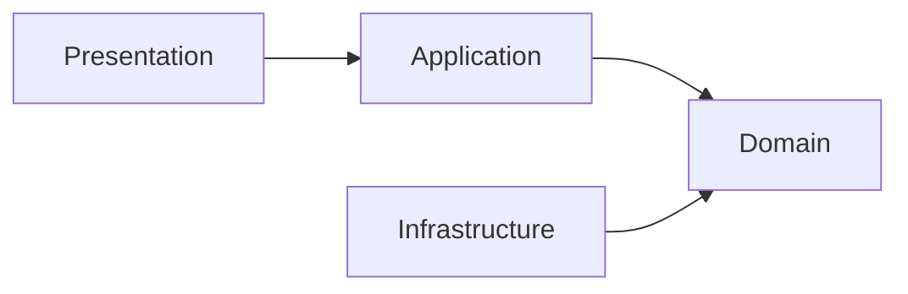
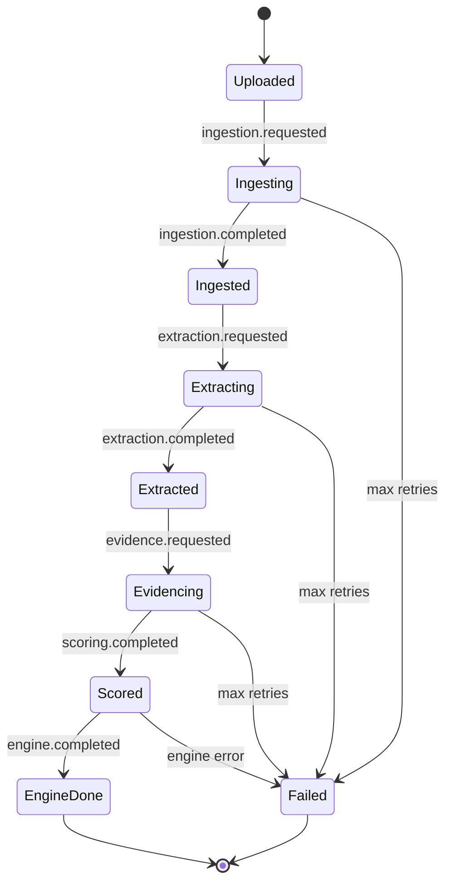
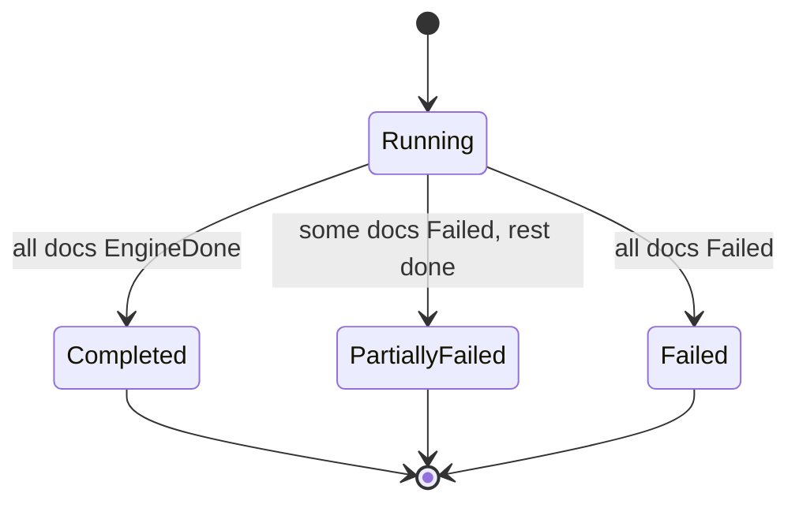
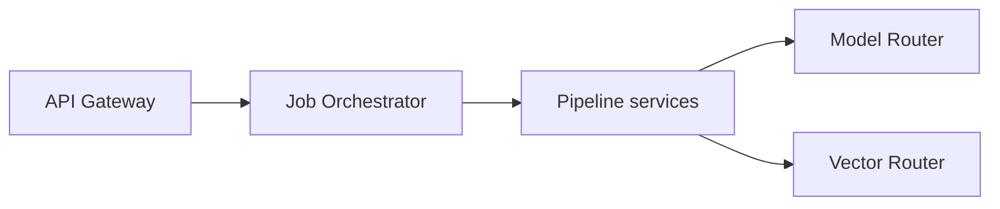

# Cortexa — Low Level Design

| Field          | Value                                  |
| -------------- | -------------------------------------- |
| Title          | Cortexa Low Level Design              |
| Version        | 0.1.15                                  |
| Date           | 2026-06-15                             |
| Status         | Approved                                  |
| Author         | QWxwaGEgU2lsdmVyQmFjaw             |
| Owner          | Alpha                                  |
| Classification | Internal — Confidential                |
| References     | [Architecture](./Cortexa_Architecture.md) |

---

## Table of Contents

1. [Document Header](#1-document-header)
2. [Overview and Design Principles](#2-overview-and-design-principles)
3. [Shared Network Contracts](#3-shared-network-contracts)
4. [Pipeline Services Domain Models](#4-pipeline-services-domain-models)
5. [Platform Utility Services](#5-platform-utility-services)
6. [API Gateway and Identity](#6-api-gateway-and-identity)
7. [Frontend Layer](#7-frontend-layer)
8. [State Machines](#8-state-machines)
9. [Key Algorithms](#9-key-algorithms)
10. [Configuration Schemas](#10-configuration-schemas)
11. [Database Schemas](#11-database-schemas)
12. [Project Folder Structure](#12-project-folder-structure)
13. [Cross-Service Integration Points](#13-cross-service-integration-points)
- [Appendix A: Glossary](#appendix-a-glossary)
- [Appendix B: Reference Documents](#appendix-b-reference-documents)
- [Appendix C: Revision History](#appendix-c-revision-history)

---

## 1. Document Header

This LLD is the code-level blueprint for Cortexa. It defines models, contracts, event schemas, and state machines per service. The [Architecture document](./Cortexa_Architecture.md) holds the "why"; this holds the precise "what".

- **Audience:** developers, code-review agents, QA.
- **Languages:** Python 3.14 (FastAPI services), C#/.NET 8 (gateway, identity, model-router, job-orchestrator), TypeScript (frontend).
- **Conventions:** diagrams in Mermaid. Code blocks are pseudocode (this is a design doc). Config blocks are exact format. Interfaces named `I{Name}` in .NET and Protocol classes in Python. Events named `{stage}.{state}`. DTOs suffixed `Dto`.

> Note: code blocks below are pseudocode by design-doc rule. Real language code is produced by developer agents from the Implementation Guide.

---

## 2. Overview and Design Principles

### 2.1 Architecture Approach



Each service follows Clean Architecture inside its own codebase. Dependencies point inward. No service imports another service's code.

### 2.2 Dependency Injection / Abstraction Pattern

Python services define interfaces as Protocol classes in `domain/`, implement them in `infrastructure/`, and wire them in a `container` module read by FastAPI dependencies.

```
# pseudocode — Python service wiring
interface CandidateRepository:
    function save(candidate) -> CandidateId
    function get_by_batch(batch_id) -> list of Candidate

class CosmosCandidateRepository implements CandidateRepository:
    constructor(cosmos_client, container_name)
    function save(candidate): ... write to Cosmos ...

function build_container(config):
    cosmos = make_cosmos_client(config.cosmos_conn)
    return Container(candidate_repo = CosmosCandidateRepository(cosmos, "candidates"))
```

.NET services register interfaces in the built-in DI container in `Program.cs` and inject through constructors.

### 2.3 Async-First Design

All I/O is async. Python uses `async def` with `httpx.AsyncClient` and async Cosmos/Service Bus clients. .NET uses `async Task` with `CancellationToken` propagated from the request through to the outbound call.

```
# pseudocode — standard async handler shape
async function handle(request, cancellation_token):
    validate(request)
    result = await repository.get(request.id, cancellation_token)
    if result is empty -> return not_found_error
    return ok(result)
```

### 2.4 Error Handling Strategy

| Layer          | Python Pattern                         | .NET Pattern                          | Notes                          |
| -------------- | -------------------------------------- | ------------------------------------- | ------------------------------ |
| Domain         | typed domain exceptions                | domain exception types                | Invariant violations           |
| Application    | Result return for expected outcomes    | Result<T> object                      | Avoids control flow by exception |
| Infrastructure | wrap client errors in infra exception  | catch and map to Result               | Retry/backoff lives here       |
| Presentation   | exception handler maps to error envelope | middleware maps to error envelope   | Uniform shape across services  |

---

## 3. Shared Network Contracts

Services share no code. They share contract shapes, defined here and versioned. Each contract is owned by the publishing service and copied (not imported) by consumers.

### 3.1 REST Error Envelope

Every service returns the same error envelope shape.

```
# pseudocode — error envelope
ErrorEnvelope:
    success: bool            # false on error
    error_code: string       # stable machine code, e.g. "EVIDENCE_SOURCE_UNAVAILABLE"
    message: string          # human text, no secrets
    correlation_id: string   # flows from gateway through pipeline
    details: optional map
```

Success responses use a matching envelope with `success: true` and a `data` field.

### 3.2 Service Bus Event Envelope

Every event carries the same wrapper. The `payload` shape differs per event type. Schemas are versioned with `schema_version` so future modules can subscribe without breaking.

```
# pseudocode — event envelope
EventEnvelope:
    event_type: string       # e.g. "extraction.completed"
    schema_version: int      # starts at 1
    batch_id: string
    document_id: optional string
    correlation_id: string
    occurred_at: timestamp
    payload: map             # event-specific
```

### 3.3 Core Event Payloads

| Event                  | Key payload fields                                            |
| ---------------------- | ------------------------------------------------------------ |
| `ingestion.completed`  | document_id, blob_uri, chunk_count, provenance_map_id        |
| `extraction.completed` | document_id, candidate_ids                                   |
| `evidence.completed`   | document_id, candidate_id, evidence_bundle_id, sources_used  |
| `scoring.completed`    | document_id, candidate_id, verdict_id, composite_score       |
| `harvesting.requested` | document_id, candidate_ids, batch_id                         |
| `seeding.requested`    | document_id, candidate_ids, batch_id                         |
| `engine.completed`     | document_id, engine, report_id                               |

---

## 4. Pipeline Services Domain Models

The six pipeline services share the same data vocabulary but each owns its slice. Models live in Cosmos, namespaced per engine.

### 4.1 Module Structure (per Python service)

```
service/
├── domain/
│   ├── models/
│   ├── enums/
│   ├── value_objects/
│   ├── events/
│   ├── repositories/   (Protocol classes only)
│   └── errors/
├── application/
│   ├── handlers/
│   ├── dtos/
│   └── validators/
├── infrastructure/
│   ├── cosmos/
│   ├── blob/
│   ├── servicebus/
│   └── clients/        (model-router, vector-router, patent APIs)
└── api/
    ├── routes/
    └── middleware/
```

### 4.2 Domain Models

```
# pseudocode — core pipeline entities
Document:
    id, batch_id, source_type ("file" | "repo")
    blob_uri, filename, mime_type, status (DocumentStatus)
    provenance_map_id, created_at

Chunk:
    id, document_id, text, order_index
    source_span (ProvenanceSpan)

InventionCandidate:
    id, document_id, batch_id
    claim_text, problem, mechanism, tech_field
    ipc_cpc_guess, source_span (ProvenanceSpan)
    created_at

EvidenceBundle:
    id, candidate_id, document_id
    hits (list of EvidenceHit), confidence_band (Low|Med|High)
    sources_used (list of EvidenceSource), merged_at

EvidenceHit:
    source (EvidenceSource), reference, citation
    similarity, contributed (bool)

Verdict:
    id, candidate_id, document_id
    axis_scores (map of ScoringAxis -> AxisScore)
    composite_score, model_mode (ModelMode)
    citations (list of citation refs), created_at

AxisScore:
    axis (ScoringAxis), score (0-100)
    confidence_band, citation_refs

HarvestingResult:
    id, candidate_id, maturity (Maturity)
    rank_score, why_patentable, blocking_note

SeedingResult:
    id, document_id, opportunity_map, claim_seeds (list)
    idf_draft, invention_lattice
```

### 4.3 Enums

```
# pseudocode — enums
DocumentStatus: Uploaded, Ingesting, Ingested, Extracting, Extracted,
                Evidencing, Scored, EngineDone, Failed

ScoringAxis: Novelty, Inventiveness, Commercial, Strategic, Patentability

Maturity: Mature, EmergingSignal

EvidenceSource: PatentApi, SeedCorpus, LlmResearch

ModelMode: SinglePrimary, SingleSecondary, DualAdversarial

ConfidenceBand: Low, Medium, High
```

### 4.4 Value Objects

```
# pseudocode — value objects (immutable, validated)
ProvenanceSpan:
    source_kind ("paper" | "code")
    locator      # paragraph id for papers, "file:line_start-line_end" for code
    validate: locator not empty

ConfidenceBandValue:
    band (Low|Med|High)
    from_score(numeric_confidence) -> band by thresholds
```

### 4.5 DTOs

```
# pseudocode — API DTOs
ExtractCandidatesRequestDto: document_id, model_mode
CandidateDto: id, claim_text, problem, mechanism, tech_field, source_span
EvidenceBundleDto: candidate_id, hits, confidence_band, sources_used
VerdictDto: candidate_id, axis_scores, composite_score, citations
PagedResultDto<T>: items, page, page_size, total
```

### 4.6 Repository Interfaces

```
# pseudocode — Protocol repositories
interface DocumentRepository:
    async save(document) -> id
    async get(id) -> Document or none
    async list_by_batch(batch_id, page, page_size) -> PagedResult

interface CandidateRepository:
    async save_many(candidates) -> list of id
    async list_by_document(document_id) -> list of Candidate

interface EvidenceRepository:
    async save(bundle) -> id
    async get_by_candidate(candidate_id) -> EvidenceBundle or none
```

### 4.7 Domain Errors

```
# pseudocode — error hierarchy
DomainError(code, message)
  ValidationError(code="VALIDATION")
  NotFoundError(code="NOT_FOUND")
  EvidenceSourceUnavailable(code="EVIDENCE_SOURCE_UNAVAILABLE")
  UngroundedVerdict(code="UNGROUNDED_VERDICT")
  ModelCallFailed(code="MODEL_CALL_FAILED")
```

---

## 5. Platform Utility Services

### 5.1 Model Router (.NET)

Single point for LLM calls. Picks provider by `ModelMode`. Enforces grounding.

```
# pseudocode — model router contract
interface IModelProvider:
    async complete(prompt, options, ct) -> ModelResult

class FoundryProvider implements IModelProvider   # primary GPT
class AnthropicProvider implements IModelProvider  # secondary Claude

class ModelRouter:
    async run(request, ct):
        if request.is_verdict and request.evidence_refs is empty:
            return error UNGROUNDED_VERDICT
        switch request.mode:
            SinglePrimary  -> return await primary.complete(...)
            SingleSecondary-> return await secondary.complete(...)
            DualAdversarial-> 
                a = await primary.complete(...)
                b = await secondary.complete(...)
                return DualResult(a, b, agreement = compare(a, b))
```

```
# pseudocode — model router request/response DTOs
ModelRequestDto: mode, task_kind, prompt, evidence_refs, options
ModelResultDto: provider, content, citations, tokens_used
DualResultDto: primary, secondary, agreement (bool), disagreement_note
```

### 5.2 Vector Router (Python)

Single point for vector and embedding work. Backend chosen by config.

```
# pseudocode — vector router
interface VectorBackend:
    async upsert(items) -> count
    async search(embedding, top_k, filter) -> list of VectorHit
    async embed(texts) -> list of embedding

class AiSearchBackend implements VectorBackend     # primary
class QdrantBackend implements VectorBackend         # secondary

class VectorRouter:
    constructor(config): backend = pick(config.vector_backend)
    async search(req): return await backend.search(...)
```

### 5.3 Job Orchestrator (.NET)

Saga coordinator. Holds batch and document state. Publishes and consumes events.

```
# pseudocode — saga step driver
class PipelineSaga:
    async on_event(event):
        switch event.event_type:
            "ingestion.completed"  -> publish "extraction.requested"
            "extraction.completed" -> publish "evidence.requested"
            "evidence.completed"   -> publish "scoring.requested"
            "scoring.completed"    -> 
                if run.wants_harvesting: publish "harvesting.requested"
                if run.wants_seeding:   publish "seeding.requested"
            "engine.completed"     -> mark_engine_done(event)
        update_batch_state(event)

    async on_stage_failure(event, attempt):
        if attempt < max_attempts: requeue_with_backoff(event, attempt+1)
        else: mark_document_failed(event); continue_batch()
```

---

## 6. API Gateway and Identity

### 6.1 API Gateway (.NET, YARP)

Routes frontend requests, validates JWT, enforces role rules, attaches correlation ID.

```
# pseudocode — gateway pipeline
async function on_request(ctx, next):
    correlation_id = ctx.header("x-correlation-id") or new_guid()
    ctx.set("correlation_id", correlation_id)
    token = read_bearer(ctx)
    claims = validate_jwt(token)        # signature, expiry, issuer
    if claims is invalid -> return 401
    route = match_route(ctx.path)
    if not role_allowed(claims.role, route.required_role) -> return 403
    await next()                         # YARP forwards to target service
```

### 6.2 Identity Service (.NET, Postgres)

```
# pseudocode — identity domain
User: id, email, username, password_hash, role (Role), entra_object_id?, created_at
RefreshToken: id, user_id, token_hash, expires_at, revoked
Role: Researcher, Reviewer, Admin

interface IUserRepository:
    async get_by_email(email) -> User or none
    async create(user) -> id

class AuthService:
    async login_password(email, password):
        user = await users.get_by_email(email)
        if user none or not verify_hash(password, user.password_hash):
            return error invalid_credentials   # generic, no user enumeration
        return issue_tokens(user)

    async login_entra(oidc_assertion):
        claims = validate_oidc(oidc_assertion)
        user = await users.get_or_create_by_entra(claims)
        return issue_tokens(user)

    function issue_tokens(user):
        access = sign_jwt(user.id, user.role, short_expiry)
        refresh = new_refresh_token(user.id, long_expiry)
        return TokenPair(access, refresh)
```

### 6.3 Response Envelope

All controllers wrap responses in the shared envelope from §3.1.

---

## 7. Frontend Layer

### 7.1 Feature-First Folder Structure

```
frontend/src/
├── features/
│   ├── auth/
│   ├── upload/          (file + repo connect, batch)
│   ├── jobs/            (progress)
│   ├── results/         (harvesting report + seeding map)
│   ├── opportunity/     (detail + score→evidence→provenance drill-down)
│   └── export/          (PDF / JSON)
├── core/
│   ├── api/             (client, interceptors, envelope)
│   ├── auth/            (token store, guards)
│   └── config/
└── shared/
    ├── components/
    └── theme/           (Fluent UI v9 tokens)
```

### 7.2 API Client Layer

```
# pseudocode — frontend API client
class ApiClient:
    constructor(base_url, token_provider)
    interceptor request: attach bearer token + correlation id
    interceptor response: on 401 -> try refresh once, else logout
    async get<T>(path) -> ApiResponse<T>
    async post<T>(path, body) -> ApiResponse<T>
```

### 7.3 Model Classes

Client-side types mirror backend DTOs: `CandidateDto`, `EvidenceBundleDto`, `VerdictDto`, `SeedingResultDto`, `HarvestingResultDto`, plus `JobStatusDto` for progress polling.

---

## 8. State Machines

### 8.1 Document Lifecycle

A document moves through the pipeline. The orchestrator advances it on each `*.completed` event. Any stage can move it to Failed.



Transition side effects: each forward transition writes the new status to Cosmos and emits the next `*.requested` event. A move to Failed dead-letters the message and records the failure reason; the batch continues.

### 8.2 Batch Lifecycle

A batch is Running while any document is unfinished. It becomes Completed when all documents reach EngineDone or Failed. It is PartiallyFailed if at least one document failed but others succeeded.



---

## 9. Key Algorithms

### 9.1 Evidence Triangulation Merge

```
function triangulate(candidate, config):
    results = run in parallel:
        patent_hits  = try patent_api_search(candidate) else mark PatentApi unavailable
        corpus_hits  = try vector_router.search(embed(candidate)) else mark SeedCorpus unavailable
        llm_hits     = try model_router.deep_research(candidate) else mark LlmResearch unavailable

    sources_used = sources that returned hits
    if sources_used is empty -> return error EVIDENCE_SOURCE_UNAVAILABLE

    all_hits = patent_hits + corpus_hits + llm_hits
    deduped  = dedup_by_patent_id_and_text(all_hits)
    confidence = confidence_band(count and agreement across sources)
    return EvidenceBundle(hits=deduped, sources_used, confidence_band=confidence)
```

**Inputs:** one InventionCandidate, config (timeouts, top_k). **Outputs:** one EvidenceBundle. **Edge cases:** all sources down → error; one source down → bundle flags it and continues; duplicate hits across sources → kept once with merged citations.

### 9.2 Five-Axis Scoring

```
function score(candidate, evidence_bundle, mode):
    if evidence_bundle has no hits -> return error UNGROUNDED_VERDICT
    prompt = build_grounded_prompt(candidate, evidence_bundle)   # citations required
    model_result = model_router.run(prompt, mode, evidence_refs=evidence_bundle.refs)
    for each axis in [Novelty, Inventiveness, Commercial, Strategic, Patentability]:
        axis_score[axis] = parse_axis(model_result, axis)        # score + confidence + citation refs
        if axis_score[axis].citation_refs is empty -> return error UNGROUNDED_VERDICT
    composite = weighted_sum(axis_score)
    return Verdict(axis_scores=axis_score, composite, model_mode=mode)
```

**Edge cases:** dual mode returns two verdicts plus an agreement flag; a missing citation on any axis fails the verdict.

### 9.3 Maturity Classification (Harvesting)

```
function classify_maturity(candidate, verdict):
    signals = count_built_evidence(candidate)   # implementation depth from source spans
    if signals high and verdict.composite >= mature_threshold -> Mature
    else -> EmergingSignal
```

### 9.4 Batch Fan-Out with Concurrency Cap

```
function start_batch(documents, concurrency_cap):
    for each document: set status Uploaded, write to Cosmos
    publish "ingestion.requested" for up to concurrency_cap documents
    on each "*.completed" at the final stage: publish next queued document
    track in-flight count; never exceed concurrency_cap
```

---

## 10. Configuration Schemas

Each service reads config from environment variables, with secrets pulled from Key Vault via managed identity. Example for the evidence service:

```yaml
# evidence service config (env-backed)
service:
  name: evidence
  port: 8080
cosmos:
  endpoint: ${COSMOS_ENDPOINT}
  database: Cortexa
  container: evidence
servicebus:
  namespace: ${SERVICEBUS_NAMESPACE}
  consume_topic: evidence.requested
  publish_topic: evidence.completed
vector_router:
  base_url: ${VECTOR_ROUTER_URL}
model_router:
  base_url: ${MODEL_ROUTER_URL}
patent_apis:
  uspto_base: https://api.data.uspto.gov
  epo_base: https://ops.epo.org
triangulation:
  per_source_timeout_ms: 8000
  top_k: 20
```

| Key                              | Env Var                | Default | Notes / Secret?         |
| -------------------------------- | ---------------------- | ------- | ----------------------- |
| cosmos.endpoint                  | COSMOS_ENDPOINT        | none    | Endpoint, not a secret  |
| servicebus.namespace             | SERVICEBUS_NAMESPACE   | none    | Connection via identity |
| patent_apis.uspto key            | USPTO_API_KEY          | none    | Secret — Key Vault      |
| patent_apis.epo oauth            | EPO_OAUTH_SECRET       | none    | Secret — Key Vault      |
| model_router.base_url            | MODEL_ROUTER_URL       | none    | Internal URL            |
| triangulation.per_source_timeout_ms | TRIANGULATION_TIMEOUT_MS | 8000 | Tuning                  |

Model-router config holds `MODEL_DEFAULT_MODE`, `FOUNDRY_ENDPOINT`, `FOUNDRY_DEPLOYMENT`, `ANTHROPIC_API_KEY` (secret). Vector-router config holds `VECTOR_BACKEND` (`ai_search` | `qdrant`), `AI_SEARCH_ENDPOINT`, `AI_SEARCH_KEY` (secret), `QDRANT_URL`.

---

## 11. Database Schemas

### 11.1 PostgreSQL (Identity)

```sql
CREATE TABLE users (
    id UUID PRIMARY KEY,
    email VARCHAR(320) NOT NULL UNIQUE,
    username VARCHAR(100) NOT NULL UNIQUE,
    password_hash TEXT,                       -- null if Entra-only
    role VARCHAR(20) NOT NULL CHECK (role IN ('Researcher','Reviewer','Admin')),
    entra_object_id VARCHAR(100) UNIQUE,      -- null if password-only
    created_at TIMESTAMPTZ NOT NULL DEFAULT now()
);

CREATE TABLE refresh_tokens (
    id UUID PRIMARY KEY,
    user_id UUID NOT NULL REFERENCES users(id) ON DELETE CASCADE,
    token_hash TEXT NOT NULL,
    expires_at TIMESTAMPTZ NOT NULL,
    revoked BOOLEAN NOT NULL DEFAULT false,
    created_at TIMESTAMPTZ NOT NULL DEFAULT now()
);

CREATE INDEX ix_refresh_tokens_user ON refresh_tokens(user_id);
CREATE INDEX ix_refresh_tokens_expiry ON refresh_tokens(expires_at);
```

### 11.2 Cosmos DB (Pipeline)

Cosmos containers are namespaced per concern. Partition key is `batch_id` for pipeline containers so a batch's reads and writes stay in one logical partition.

| Container    | Partition Key | Holds                                  |
| ------------ | ------------- | -------------------------------------- |
| documents    | /batch_id     | Document records with status           |
| chunks       | /document_id  | Text chunks with provenance spans      |
| candidates   | /batch_id     | Invention candidates                   |
| evidence     | /batch_id     | Evidence bundles                       |
| verdicts     | /batch_id     | Scored verdicts                        |
| harvesting   | /batch_id     | Harvesting results and reports         |
| seeding      | /batch_id     | Seeding results, maps, lattices        |
| batches      | /batch_id     | Batch state for the saga               |

Document store collection shape example:

```
# documents container item
{
  "id": "<doc-guid>",
  "batch_id": "<batch-guid>",
  "engine_namespace": "harvesting" | "seeding" | "both",
  "source_type": "file" | "repo",
  "blob_uri": "https://.../raw/<doc>",
  "status": "Scored",
  "provenance_map_id": "<guid>",
  "created_at": "2026-06-13T00:00:00Z"
}
```

Schema versioning: each Cosmos item carries a `schema_version` field. Readers tolerate older versions. No destructive migration during the MVP.

---

## 12. Project Folder Structure

```
Cortexa/
├── services/
│   ├── api-gateway/          (.NET 8, YARP)
│   ├── identity/             (.NET 8 + Postgres)
│   ├── model-router/         (.NET 8)
│   ├── job-orchestrator/     (.NET 8)
│   ├── vector-router/        (Python FastAPI)
│   ├── ingestion/            (Python FastAPI)
│   ├── extraction/           (Python FastAPI)
│   ├── evidence/             (Python FastAPI)
│   ├── scoring/              (Python FastAPI)
│   ├── harvesting/           (Python FastAPI)
│   └── seeding/              (Python FastAPI)
├── frontend/                 (React + TS + Vite + Fluent UI v9)
├── deploy/                   (Terraform)
│   ├── modules/
│   ├── environments/{dev,prod}/
│   └── main.tf
├── .github/workflows/        (ci.yml, cd.yml, release.yml)
├── azure-pipelines/          (ci.yml, cd.yml, release.yml)
└── CLAUDE.md
```

Each service folder is self-contained: own project file (`pyproject.toml` or `.csproj`), own `Dockerfile`, own `tests/`, own README.

---

## 13. Cross-Service Integration Points



| Caller           | Callee           | Interface          | Method                 | Data Flow                         |
| ---------------- | ---------------- | ------------------ | ---------------------- | --------------------------------- |
| frontend         | api-gateway      | REST               | POST /batches          | upload metadata → batch id        |
| api-gateway      | job-orchestrator | REST               | POST /batches/start    | batch id → accepted               |
| job-orchestrator | ingestion        | Service Bus        | ingestion.requested    | document ref → ingested event     |
| extraction       | model-router     | REST               | POST /complete         | prompt → candidates               |
| evidence         | vector-router    | REST               | POST /search           | embedding → corpus hits           |
| evidence         | patent APIs      | HTTPS              | GET search             | query → patent hits               |
| scoring          | model-router     | REST               | POST /complete         | grounded prompt → verdict         |
| seeding          | model-router     | REST               | POST /complete         | grounded prompt → seeds + lattice |
| all services     | identity         | JWT (offline check)| token validation       | token → claims                    |

DI wiring: each service builds its container at startup, reading config and Key Vault secrets through managed identity. Inter-service URLs come from config, never hardcoded.

---

## Appendix A: Glossary

| Term            | Definition                                                  |
| --------------- | ----------------------------------------------------------- |
| Saga            | Long-running coordinator that drives pipeline stages by events |
| Dead-letter     | A Service Bus queue holding messages that failed all retries |
| Grounded prompt | An LLM prompt that includes the evidence the model must cite |
| Provenance span | A locator back to a source paragraph or file line range      |

## Appendix B: Reference Documents

| Document             | Location                                  | Purpose                        |
| -------------------- | ----------------------------------------- | ------------------------------ |
| Architecture         | `./Cortexa_Architecture.md`              | High-level why and shape       |
| Implementation Guide | `./Cortexa_ImplementationGuide.md`       | Build order and steps          |
| Project Plan         | `./Cortexa_ProjectPlan.md`               | Phases and backlog             |

## Appendix C: Revision History

| Version | Date       | Author                     | Changes       |
| ------- | ---------- | -------------------------- | ------------- |
| 0.1.0   | 2026-06-13 | QWxwaGEgU2lsdmVyQmFjaw | Initial draft |

---

**End of Document** — Cortexa Low Level Design v0.1.0
