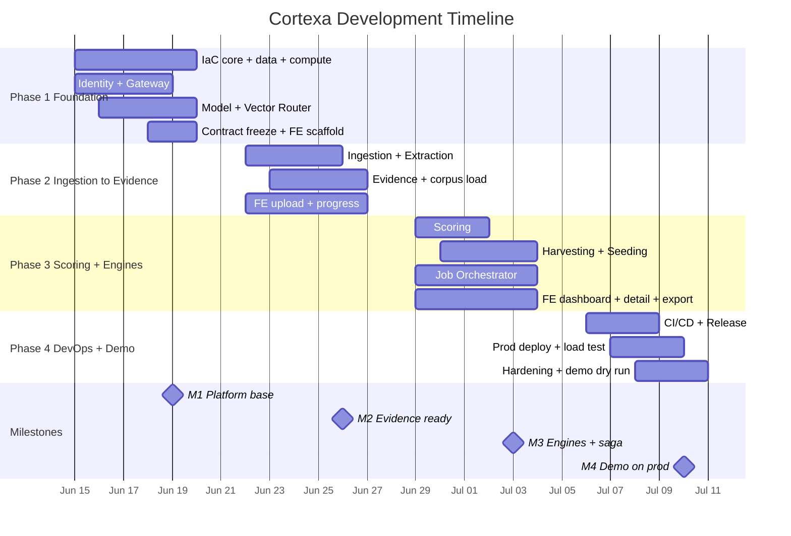
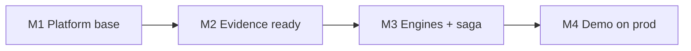
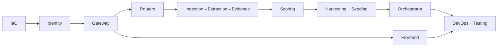
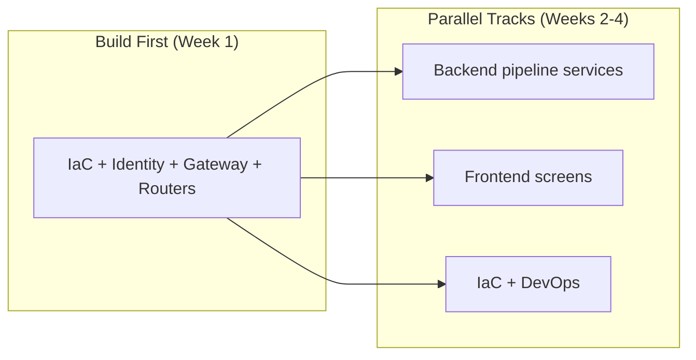
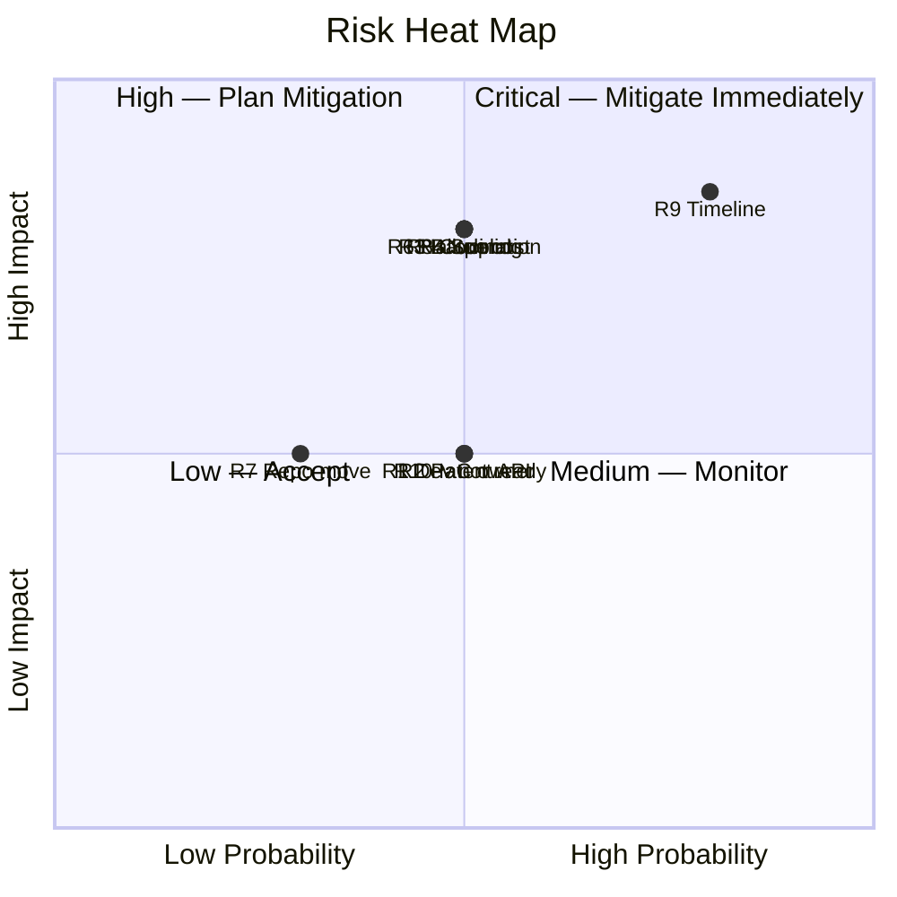
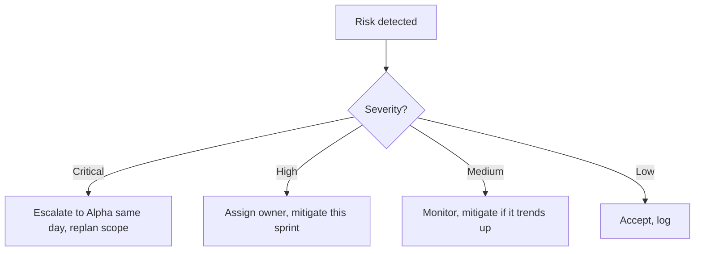
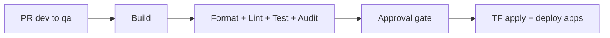

# Cortexa — Comprehensive Project Plan

| Field          | Value                                  |
| -------------- | -------------------------------------- |
| Title          | Cortexa Project Plan                  |
| Version        | 0.1.15                                  |
| Date           | 2026-06-15                             |
| Status         | Approved                                  |
| Author         | QWxwaGEgU2lsdmVyQmFjaw             |
| Owner          | Alpha                                  |
| Classification | Internal — Confidential                |

---

## Table of Contents

1. [Project Overview](#1-project-overview)
2. [Development Phases](#2-development-phases)
3. [Gantt Chart](#3-gantt-chart)
4. [Milestones](#4-milestones)
5. [Work Breakdown Structure](#5-work-breakdown-structure)
6. [Build Order and Dependencies](#6-build-order-and-dependencies)
7. [Risk Register](#7-risk-register)
8. [Quality Gates](#8-quality-gates)
9. [Deployment Strategy](#9-deployment-strategy)
10. [Development Workflow](#10-development-workflow)
11. [Resource Requirements](#11-resource-requirements)
12. [Dependency Management](#12-dependency-management)
13. [Communication and Reporting](#13-communication-and-reporting)
14. [Post-MVP Roadmap](#14-post-mvp-roadmap)
15. [Cost Estimation](#15-cost-estimation)
16. [Assumptions and Constraints](#16-assumptions-and-constraints)
- [Appendix A: Glossary](#appendix-a-glossary)
- [Appendix B: Reference Documents](#appendix-b-reference-documents)

---

## 1. Project Overview

### 1.1 Vision

Cortexa reads research papers, thesis files, and code, then tells you where a patent opportunity is hiding. The Harvesting Engine finds inventions already in the asset. The Seeding Engine proposes new ones from the asset plus roadmap context. Every score is backed by three independent evidence sources with citations, so an attorney can trust the number. This MVP delivers exactly these two engines, deployed live on Azure, in one month.

### 1.2 Objectives

| ID  | Objective                                          | Measure of Success                                    |
| --- | -------------------------------------------------- | ----------------------------------------------------- |
| O1  | Build 11 independent services in a monorepo        | Each builds, tests, and deploys alone                 |
| O2  | Run the full pipeline on Azure                     | 100-document batch finishes on Container Apps         |
| O3  | Ground every verdict                               | No score ships without citations                      |
| O4  | Switch models at runtime                           | Single GPT, single Claude, or both, no redeploy       |
| O5  | Deliver the seeding demo                           | Paper upload returns map + IDF + seeds + lattice + scored card |
| O6  | All infrastructure as code                         | Terraform creates every resource, nothing manual      |

### 1.3 Scope

#### In-Scope (MVP v0.1.0)

- Both engines: upload PDF/DOCX, connect one git repo, batch of 100+ docs, candidate extraction with provenance, three-source prior art, 5-axis scoring, model switch, results dashboard with drill-down, export PDF/JSON.
- Harvesting: maturity classification, ranked report.
- Seeding: opportunity map, IDF, claim seeds, invention lattice.
- Identity with email/password and Entra ID, 3 roles.
- Terraform IaC for dev and prod; CI/CD on both GitHub Actions and Azure Pipelines.

#### Out-of-Scope (MVP)

- Legal filing automation, attorney workflow, e-sign.
- Portfolio valuation, renewal tracking, competitor monitoring.
- Full multi-tenant billing and large RBAC matrix.
- Figure/diagram computer vision (text and code only).
- Any language other than English.

### 1.4 Success Criteria

| Category       | Criterion                                         | Target                          |
| -------------- | ------------------------------------------------- | ------------------------------- |
| Throughput     | 100+ docs batch completes on Azure                | Pass                            |
| Repo path      | One git repo connects and extracts candidates     | Pass                            |
| Seeding demo   | Map + IDF + seeds + lattice + scored card         | Pass                            |
| Harvesting     | Ranked report with Mature vs Emerging             | Pass                            |
| Provenance     | Every score drills to cited evidence              | Pass                            |
| Model switch   | Single GPT, single Claude, both, at runtime       | Pass                            |
| Independence   | 11 services run as separate Container Apps         | Pass                            |
| Auth           | Email/password and Microsoft account both work    | Pass                            |
| IaC            | All resources created by Terraform                | Pass                            |

---

## 2. Development Phases

Four one-week sprints. One week is one sprint. Phases follow proposal §10 dependency order. After contracts freeze at the end of Sprint 1, three tracks run in parallel: IaC, backend services, and frontend. The IaC and DevOps work spans all four sprints owned by one engineer with subscription admin rights.

### Phase 1: Foundation and Core Platform (Week 1, 2026-06-15 to 2026-06-19)

**Objective:** stand up IaC, identity, gateway, and both routers so the pipeline has a base.

| Task ID | Task                          | Description                                                  | Deliverable                          |
| ------- | ----------------------------- | ------------------------------------------------------------ | ------------------------------------ |
| P1-01   | State backend bootstrap       | Create Azure Blob state account and container manually        | State backend ready                  |
| P1-02   | Terraform core modules        | key-vault, container-registry, monitoring, blob-storage modules | 4 TF modules                       |
| P1-03   | Terraform data modules        | cosmos-db, postgresql, service-bus modules                    | 3 TF modules                         |
| P1-04   | Terraform compute modules     | container-apps, static-web-app, ai-search modules             | 3 TF modules                         |
| P1-05   | Terraform AI module           | ai-foundry module with GPT deployment                         | 1 TF module                          |
| P1-06   | Dev environment composition   | environments/dev with minimal SKUs and scale-to-zero          | dev env applies                      |
| P1-07   | Budget alert                  | Budget alert resource in dev                                  | Alert active week 1                  |
| P1-08   | Identity domain + DB schema   | User, RefreshToken, Role; Postgres schema and migration       | Schema + migration                   |
| P1-09   | Identity password login       | Email/password login, hashing, JWT issue                      | /auth/login                          |
| P1-10   | Identity refresh + roles      | Refresh token rotation, role claims                           | /auth/refresh                        |
| P1-11   | Identity Entra ID login       | OIDC login, claim mapping, get-or-create user                 | /auth/entra                          |
| P1-12   | API Gateway routing           | YARP routes for all services                                  | Route config                         |
| P1-13   | API Gateway auth middleware   | JWT validation + role enforcement + correlation id            | Gateway middleware                   |
| P1-14   | Model Router providers        | IModelProvider, Foundry and Anthropic adapters                | Two adapters                         |
| P1-15   | Model Router modes + grounding| Mode switch, dual mode, grounding rejection                   | /complete, /complete/dual            |
| P1-16   | Vector Router backends        | VectorBackend, AiSearch and Qdrant adapters, config switch    | /search, /upsert, /embed             |
| P1-17   | Contract freeze v1            | Publish REST + event envelope schemas v1                      | Versioned contract docs              |
| P1-18   | Frontend scaffold + auth      | Vite + React + Fluent UI v9, login screen, API client         | App shell + login                    |

**Exit Criteria:** dev environment applies; identity issues valid tokens; gateway enforces auth; both routers respond; contracts v1 are frozen.

### Phase 2: Ingestion to Evidence (Week 2, 2026-06-22 to 2026-06-26)

**Objective:** build the front half of the pipeline up to the Evidence Bundle.

| Task ID | Task                          | Description                                                  | Deliverable                          |
| ------- | ----------------------------- | ------------------------------------------------------------ | ------------------------------------ |
| P2-01   | Ingestion file parsing        | PDF/DOCX text parse and normalize                            | Parser                               |
| P2-02   | Ingestion repo clone          | GitHub/Azure DevOps read-only clone with caps                | Repo cloner                          |
| P2-03   | Ingestion chunking            | Chunk text with order index                                  | Chunker                              |
| P2-04   | Ingestion provenance map      | Build source spans for papers and code                       | Provenance map                       |
| P2-05   | Ingestion storage + event     | Write raw to Blob, chunks to Cosmos, publish completed       | ingestion.completed                  |
| P2-06   | Extraction prompt + call      | Build extraction prompt, call model-router                   | Extraction client                    |
| P2-07   | Extraction candidate parsing  | Parse structured candidates with source spans                | Candidate parser                     |
| P2-08   | Extraction storage + event    | Store candidates, publish completed                          | extraction.completed                 |
| P2-09   | Patent API adapter            | USPTO + EPO behind one interface                             | Patent adapter                       |
| P2-10   | Evidence corpus search        | Call vector-router for seed corpus hits                      | Corpus search                        |
| P2-11   | Evidence LLM research         | Call model-router for deep research                          | Research client                      |
| P2-12   | Evidence triangulation merge  | Parallel sources, dedup, confidence band, source flags       | Triangulation merge                  |
| P2-13   | Evidence storage + event      | Store bundle, publish completed                              | evidence.completed                   |
| P2-14   | Seed corpus load              | Embed and load curated patents into vector store             | Seeded index                         |
| P2-15   | Frontend upload + batch       | Upload screen, batch upload, repo connect                    | Upload feature                       |
| P2-16   | Frontend job progress         | Poll and show batch and document progress                    | Progress feature                     |
| P2-17   | Patent API key wiring         | USPTO key + EPO OAuth in Key Vault, adapter config           | Keys wired                           |

**Exit Criteria:** a document goes from upload to a stored Evidence Bundle; one source down still produces a flagged bundle; corpus index is loaded.

### Phase 3: Scoring, Engines, Orchestration (Week 3, 2026-06-29 to 2026-07-03)

**Objective:** complete the back half — scoring, both engines, and the batch saga.

| Task ID | Task                          | Description                                                  | Deliverable                          |
| ------- | ----------------------------- | ------------------------------------------------------------ | ------------------------------------ |
| P3-01   | Scoring grounded prompt       | Build grounded prompt from Evidence Bundle                   | Prompt builder                       |
| P3-02   | Scoring axis parse + reject   | Parse 5 axes with citations, reject ungrounded               | Axis parser                          |
| P3-03   | Scoring dual mode             | Dual-model scoring with agreement flag                       | Dual scoring                         |
| P3-04   | Scoring storage + event       | Store verdict, publish completed                             | scoring.completed                    |
| P3-05   | Harvesting maturity           | Mature vs Emerging classification                            | Maturity classifier                  |
| P3-06   | Harvesting ranking            | Rank by uniqueness, feasibility, strategic, patentability    | Ranker                               |
| P3-07   | Harvesting report             | Assemble report with citations and provenance                | engine.completed (harvesting)        |
| P3-08   | Seeding opportunity map       | Whitespace, defensive, adjacent, continuation                | Opportunity map                      |
| P3-09   | Seeding IDF + abstract        | Draft IDF, abstract, background, summary                     | IDF generator                        |
| P3-10   | Seeding claim seeds           | Generate claim seeds                                         | Claim seed generator                 |
| P3-11   | Seeding invention lattice     | Core → continuation → platform → system                      | Lattice + engine.completed (seeding) |
| P3-12   | Orchestrator saga state       | Saga state machine, batch and document state in Cosmos       | Saga core                            |
| P3-13   | Orchestrator event wiring     | Consume completed, publish next requested                    | Event driver                         |
| P3-14   | Orchestrator retry + DLQ      | Retry with backoff, dead-letter, mark-failed continue        | Failure handling                     |
| P3-15   | Orchestrator concurrency cap  | Fan-out with concurrency cap for batches                     | Batch fan-out                        |
| P3-16   | Frontend results dashboard    | Harvesting report and seeding opportunity map views          | Dashboard feature                    |
| P3-17   | Frontend opportunity detail   | Score → evidence → provenance drill-down                     | Detail feature                       |
| P3-18   | Frontend export               | Export verdict and report as PDF / JSON                      | Export feature                       |

**Exit Criteria:** a verdict is produced and grounded; both engines produce output; the saga drives a small multi-document batch end to end; dashboards show results with drill-down.

### Phase 4: DevOps, Integration, Demo Hardening (Week 4, 2026-07-06 to 2026-07-10)

**Objective:** finish CI/CD, run the full 100-doc batch, harden, and prepare the prod demo.

| Task ID | Task                          | Description                                                  | Deliverable                          |
| ------- | ----------------------------- | ------------------------------------------------------------ | ------------------------------------ |
| P4-01   | CI pipelines per service      | ci.yml: format, lint, test, audit, build (GitHub + Azure)    | Per-service CI                       |
| P4-02   | CD pipeline                   | cd.yml: TF plan/apply + per-service deploy, gated            | CD pipeline                          |
| P4-03   | Release pipeline              | release.yml on version tag, gated, prod deploy               | Release pipeline                     |
| P4-04   | Prod environment apply        | environments/prod with Premium SKUs                          | Prod env live                        |
| P4-05   | All services on Container Apps| Deploy 11 services as separate apps with KEDA autoscale      | 11 apps running                      |
| P4-06   | Integration test suite        | Cross-service pipeline tests                                 | Integration tests                    |
| P4-07   | E2E test suite                | Upload → verdict → drill-down → export                       | E2E tests                            |
| P4-08   | 100-doc load test             | Run and tune a 100+ document batch on Azure                  | Load test pass                       |
| P4-09   | Model switch verification     | Verify single GPT, single Claude, dual at runtime            | Switch verified                      |
| P4-10   | Auth verification             | Verify email/password and Entra ID logins                    | Auth verified                        |
| P4-11   | Observability dashboards      | App Insights dashboards and alerts                           | Dashboards + alerts                  |
| P4-12   | Security pass                 | Secrets in Key Vault, redaction, input validation review     | Security checklist signed            |
| P4-13   | Cost check                    | Confirm dev spend within budget, scale-to-zero working       | Cost report                          |
| P4-14   | Demo dry run                  | Full seeding demo on prod with the demo paper                | Demo rehearsed                       |
| P4-15   | Bug burn-down                 | Fix P0/P1 issues from integration and E2E                    | No open P0/P1                        |
| P4-16   | Demo data prep                | Load demo corpus matching the demo paper field               | Demo dataset                         |

**Exit Criteria:** all 11 services run on Azure; 100-doc batch passes; demo runs on prod; no open P0/P1; spend within budget.

---

## 3. Gantt Chart



Critical path: IaC → Identity/Gateway → Routers → Ingestion → Extraction → Evidence → Scoring → Engines → Orchestrator → DevOps → Demo. The frontend track and IaC/DevOps track run alongside the backend track once contracts freeze at the end of Week 1.

---

## 4. Milestones

| #   | Milestone        | Target Week | Target Date    | Acceptance Criteria                                  |
| --- | ---------------- | ----------- | -------------- | ---------------------------------------------------- |
| M1  | Platform base    | Week 1      | 2026-06-19     | Dev env applies; auth, gateway, routers up; contracts frozen |
| M2  | Evidence ready   | Week 2      | 2026-06-26     | Upload → Evidence Bundle; corpus loaded; source fallback works |
| M3  | Engines + saga   | Week 3      | 2026-07-03     | Grounded verdict; both engines; saga runs a batch     |
| M4  | Demo on prod     | Week 4      | 2026-07-10     | 11 services on Azure; 100-doc batch; demo runs; no P0/P1 |

### Milestone Dependency Chain



---

## 5. Work Breakdown Structure

| Phase   | Component        | Subcomponents                                            |
| ------- | ---------------- | -------------------------------------------------------- |
| Phase 1 | IaC              | state backend, core/data/compute/AI modules, dev env, budget alert |
| Phase 1 | Identity         | schema, password login, refresh+roles, Entra ID          |
| Phase 1 | API Gateway      | routing, auth middleware                                  |
| Phase 1 | Routers          | model-router providers/modes/grounding, vector-router backends |
| Phase 1 | Frontend base    | scaffold, login, API client, contract freeze             |
| Phase 2 | Ingestion        | parse, clone, chunk, provenance, storage+event           |
| Phase 2 | Extraction       | prompt, candidate parse, storage+event                   |
| Phase 2 | Evidence         | patent adapter, corpus search, LLM research, merge, corpus load |
| Phase 2 | Frontend         | upload/batch/repo connect, job progress                  |
| Phase 3 | Scoring          | grounded prompt, axis parse, dual mode, storage+event    |
| Phase 3 | Harvesting       | maturity, ranking, report                                |
| Phase 3 | Seeding          | opportunity map, IDF, claim seeds, lattice               |
| Phase 3 | Orchestrator     | saga state, event wiring, retry/DLQ, concurrency cap     |
| Phase 3 | Frontend         | dashboard, opportunity detail, export                    |
| Phase 4 | DevOps           | CI, CD, release, prod apply, all-services deploy         |
| Phase 4 | Testing          | integration, E2E, 100-doc load                           |
| Phase 4 | Hardening        | model/auth verify, observability, security, cost, demo prep |

---

## 6. Build Order and Dependencies

### Dependency Graph



### Build Order

| Order | Component         | Depends On                | Reason                                     |
| ----- | ----------------- | ------------------------- | ------------------------------------------ |
| 1     | IaC               | None                      | Every service needs Azure resources        |
| 2     | Identity          | IaC (Postgres)            | Auth is a prerequisite for everything       |
| 3     | API Gateway       | Identity                  | Routing needed before services are callable |
| 4     | Model Router      | Gateway                   | Needed by extraction, scoring, seeding, harvesting |
| 5     | Vector Router     | Gateway                   | Needed by evidence                          |
| 6     | Ingestion         | Routers                   | Start of the data pipeline                  |
| 7     | Extraction        | Ingestion                 | Depends on ingestion output                 |
| 8     | Evidence          | Extraction, Vector Router | Depends on candidates and corpus            |
| 9     | Scoring           | Evidence                  | Depends on Evidence Bundle                  |
| 10    | Harvesting        | Scoring                   | Depends on verdict                          |
| 11    | Seeding           | Scoring                   | Depends on verdict                          |
| 12    | Job Orchestrator  | All pipeline services     | Ties the pipeline together                  |
| 13    | Frontend          | Stable backend contracts  | Needs frozen contracts                      |
| 14    | DevOps            | All services              | Per-service CI/CD and promotion             |
| 15    | Testing           | Full pipeline             | Integration, E2E, load                      |

### Parallelization Opportunities



---

## 7. Risk Register

### Risk Matrix

| ID  | Risk                                          | Probability | Impact | Severity | Mitigation                                          |
| --- | --------------------------------------------- | ----------- | ------ | -------- | --------------------------------------------------- |
| R1  | Dev Azure resources not ready early           | Med         | Med    | Medium   | Run IaC track first; CI green without Azure         |
| R2  | Patent API rate limit or block in one month   | Med         | Med    | Medium   | Three-source design; corpus + LLM still work        |
| R3  | 100-doc cost and latency                      | Med         | High   | High     | Queue + KEDA autoscale, cache embeddings, cap concurrency |
| R4  | Azure spend overrun                           | Med         | High   | High     | Scale-to-zero dev, basic SKUs, budget alert week 1  |
| R5  | Scope creep into other modules               | Med         | High   | High     | Hard scope table; other modules deferred            |
| R6  | LLM invents novelty                           | Med         | High   | High     | Mandatory grounding; show disagreement              |
| R7  | Repo location changes (GitHub vs Azure DevOps)| Low         | Med    | Low      | Both pipeline formats maintained                    |
| R8  | Service coupling drift across 14 devs         | Med         | High   | High     | Network-only contracts; no shared libraries         |
| R9  | One-month timeline too tight for full scope   | High        | High   | Critical | Parallel tracks; aggressive story splitting; demo-first sequencing |
| R10 | Single IaC owner is a bottleneck              | Med         | Med    | Medium   | Read access for all; review IaC PRs early           |

### Risk Heat Map



### Risk Response Plan



---

## 8. Quality Gates

### Phase Gate Criteria

Each phase must satisfy its gate before the next begins.

#### Gate 1 → 2: Platform base

| Criterion        | Requirement                                  |
| ---------------- | -------------------------------------------- |
| Dev env          | `terraform apply` succeeds in dev            |
| Auth             | Token issues and validates; roles enforced   |
| Routers          | Both routers respond; grounding rejection works |
| Contracts        | REST + event schemas v1 published and frozen |

#### Gate 2 → 3: Evidence ready

| Criterion        | Requirement                                  |
| ---------------- | -------------------------------------------- |
| Pipeline front   | Upload → Evidence Bundle works               |
| Fallback         | One source down still yields a flagged bundle |
| Corpus           | Seed corpus loaded and searchable            |

#### Gate 3 → 4: Engines and saga

| Criterion        | Requirement                                  |
| ---------------- | -------------------------------------------- |
| Scoring          | Grounded 5-axis verdict; ungrounded rejected |
| Engines          | Harvesting and seeding both produce output    |
| Saga             | Multi-document batch runs end to end          |

### Code Review Requirements

| Scope                         | Reviewer                | Criteria                              |
| ----------------------------- | ----------------------- | ------------------------------------- |
| Every work item               | code-reviewer-expert    | Blockers only: security, correctness, architecture, ACE |
| Auth, scoring, saga, evidence | code-reviewer + tester  | Critical path; tests required          |
| Security-sensitive or >10 files | code-reviewer-expert  | Full review per global heuristics      |

### Language-Specific Quality Rules

Python passes `ruff check` with zero warnings. .NET builds with `-warnaserror`. Frontend passes `eslint`. No service merges with failing CI.

---

## 9. Deployment Strategy

### Azure Service Map

| Service             | Purpose                                  |
| ------------------- | ---------------------------------------- |
| Container Apps      | Host all 11 services, one app each        |
| Static Web Apps     | Host the React frontend                  |
| AI Foundry          | Primary GPT model                        |
| AI Search           | Primary vector store                     |
| Cosmos DB           | Pipeline data                            |
| PostgreSQL Flexible | Identity data                            |
| Blob Storage        | Raw files and Terraform state            |
| Service Bus         | Pipeline messaging                       |
| Key Vault           | Secrets                                  |
| Container Registry  | Service images                           |
| App Insights + LAW  | Logs, traces, alerts                     |

### Deployment Topology

Frontend on Static Web Apps calls the API Gateway Container App. The gateway routes to the other 10 Container Apps. Services reach Cosmos, Postgres, Blob, Service Bus, AI Search, and AI Foundry over private endpoints. Secrets come from Key Vault through managed identity. See Deployment Design for the full topology and module breakdown.

### Environment Configuration

| Environment | SKUs               | Service Bus      | Purpose                          |
| ----------- | ------------------ | ---------------- | -------------------------------- |
| Development | Minimal, scale-to-zero | Standard      | Daily dev and testing            |
| Production  | Higher, always-on  | Premium          | Final staging and demo           |

### Deployment Process

1. Merge to qa triggers CD.
2. CD runs Terraform plan, waits for approval, then applies.
3. CD builds and pushes each changed service image to ACR.
4. CD deploys each service to its Container App.
5. Smoke checks run; health endpoints must pass.
6. For prod, a version tag triggers release.yml with its own approval gate.

---

## 10. Development Workflow

### Branch Strategy

```mermaid
gitgraph
    commit id: "init"
    branch develop
    commit id: "phase 1"
    branch develop/US-001
    commit id: "story work"
    checkout develop
    merge develop/US-001
    branch release/v0.1.0
    checkout main
    merge release/v0.1.0 tag: "v0.1.0"
```

| Branch                   | Purpose                          | Lifetime         |
| ------------------------ | -------------------------------- | ---------------- |
| `main`                   | Released code                    | Permanent        |
| `dev`                    | Integration branch               | Permanent        |
| `qa`                     | Pre-deploy branch, triggers CD   | Permanent        |
| `develop/{ITEM_ID}`      | User story work                  | Until merged     |
| `bugfix/{description}`   | Bug fix                          | Until merged     |
| `release/v{X.Y.Z}`       | Release prep, tagged             | Until merged     |

### Commit Message Convention

Commits follow Conventional Commits: `<type>(<scope>): <description>`. Scope is the service name.

| Type       | When to Use                     |
| ---------- | ------------------------------- |
| `feat`     | New feature                     |
| `fix`      | Bug fix                         |
| `refactor` | Restructure, no behavior change |
| `test`     | Tests                           |
| `docs`     | Documentation                   |
| `chore`    | Tooling / CI                    |
| `perf`     | Performance                     |
| `security` | Security change                 |

### Code Review Process

1. Branch `develop/{ITEM_ID}` from dev.
2. Push and open a PR from dev to qa.
3. CI runs format, lint, test, audit, build.
4. code-reviewer-expert reviews; tester runs on critical-path items.
5. Merge on approval and green CI.

### CI/CD Pipeline Stages



---

## 11. Resource Requirements

### Development Toolchain

| Tool       | Version  | Purpose             |
| ---------- | -------- | ------------------- |
| Python     | 3.14     | FastAPI services    |
| .NET SDK   | 8.0      | C# services         |
| Node.js    | 24 LTS   | Frontend            |
| Terraform  | 1.7+     | IaC                 |
| Docker     | latest   | Images              |
| Azure CLI  | latest   | Azure ops           |

### External Accounts Required

| Account                  | Purpose             | Phase Needed |
| ------------------------ | ------------------- | ------------ |
| Azure subscription       | All infrastructure  | Phase 1      |
| AI Foundry quota (GPT)   | LLM primary         | Phase 1      |
| Anthropic API key        | LLM secondary       | Phase 1      |
| USPTO Open Data key      | Patent live lookup  | Phase 2      |
| EPO OPS OAuth key        | International prior art | Phase 2   |
| GitHub/Azure DevOps PAT  | Repo clone          | Phase 2      |
| Entra ID app registration| Secondary login     | Phase 1      |

### Hardware Recommendations

| Component | Minimum | Recommended |
| --------- | ------- | ----------- |
| CPU       | 4 cores | 8 cores     |
| RAM       | 8 GB    | 16 GB       |
| Storage   | 20 GB   | 40 GB       |

### Testing Environments

| Environment | Platform              | Purpose                       |
| ----------- | --------------------- | ----------------------------- |
| Local       | Docker Compose + emulators | Per-service dev          |
| Dev (Azure) | Container Apps, minimal SKUs | Integration and load   |
| Prod (Azure)| Container Apps, higher SKUs  | Demo and final staging |

---

## 12. Dependency Management

### Key Package Versions

| Package                  | Version | Purpose             | Stability |
| ------------------------ | ------- | ------------------- | --------- |
| fastapi                  | latest stable | Python services | Stable    |
| pydantic                 | v2      | Validation          | Stable    |
| azure-cosmos / servicebus / storage-blob | latest | Azure SDKs | Stable |
| Yarp.ReverseProxy        | latest  | Gateway             | Stable    |
| @fluentui/react-components | v9    | Frontend UI         | Stable    |
| vite                     | latest  | Frontend build      | Stable    |

### Update Strategy

| Activity                   | Frequency       | Tool                          |
| -------------------------- | --------------- | ----------------------------- |
| Vulnerability scanning     | Every CI run    | pip-audit, dotnet vulnerable, npm audit |
| Dependency updates (patch) | Weekly          | Manual review                 |
| Dependency updates (major) | Post-MVP        | Review process                |

### License Compliance

| Acceptable Licenses        | Status   |
| -------------------------- | -------- |
| MIT, Apache-2.0, BSD       | Allowed  |

| Restricted Licenses        | Status   |
| -------------------------- | -------- |
| GPL/AGPL in shipped code    | Not allowed (copyleft risk) |

---

## 13. Communication and Reporting

### Progress Tracking

| Level   | Granularity         | Updated By       | Format              |
| ------- | ------------------- | ---------------- | ------------------- |
| Phase   | Per sprint          | PM               | Milestone report    |
| Task    | Per work item       | Developer agents | Work-item JSON + tracker |
| Daily   | Per standup         | Core devs        | Short status        |

### Status Reporting Format

```
## Weekly Status Report — Week {N}

### Phase: {current phase}
### Overall Progress: {X}% of MVP

#### Completed This Week
- [Task ID] {description}

#### In Progress
- [Task ID] {description} ({X}%, ETA {date})

#### Blocked
- [Task ID] {description} — blocker: {…}; action needed: {…}

#### Risks Materialized
- [Risk ID] {description and impact}

#### Plan for Next Week
- [Task ID] {planned work}

#### Metrics
- {metric}: {value}/{target}
```

### Issue Tracking

| Priority      | Response Time    | Resolution Target |
| ------------- | ---------------- | ----------------- |
| P0 — Blocker  | Immediate        | Same day          |
| P1 — Critical | Within 4 hours   | 2 days            |
| P2 — Major    | Within 1 day     | 1 week            |
| P3 — Minor    | Within 1 week    | Next phase        |
| P4 — Trivial  | As available     | Backlog           |

---

## 14. Post-MVP Roadmap

Features deferred beyond v0.1.0, kept in view so MVP decisions do not block them.

### Platform Expansion

| Feature                  | Description                                | Value                       |
| ------------------------ | ------------------------------------------ | --------------------------- |
| Portfolio valuation      | Value an IP portfolio                      | New module on same pipeline |
| Competitor monitoring    | Track competitor filings                   | New saga + event topics     |
| Filing automation        | Attorney workflow, e-sign                  | Builds on verdicts          |
| Figure CV analysis       | Diagram and figure understanding           | Adds an extraction source   |
| Multi-tenant billing     | Full RBAC and billing                      | Extends identity            |

### Architectural Decisions Preserving Future Options

| Future Feature           | MVP Decision That Enables It                       |
| ------------------------ | -------------------------------------------------- |
| New engines              | Saga pattern + versioned event topics              |
| New LLM-using modules    | model-router as a shared platform utility          |
| New vector-using modules | vector-router as a shared platform utility         |
| New roles                | Extensible JWT claims and role set                 |
| New data namespaces      | Cosmos/Blob namespaced per engine                  |

---

## 15. Cost Estimation

Rough monthly Azure estimates for the dev environment during the build, plus a short prod burst for the demo. Numbers are order-of-magnitude, to be confirmed against the actual subscription and AI Foundry quota.

### Azure Dev Environment (one month)

| Service / Item          | Estimated Cost | Notes                                   |
| ----------------------- | -------------- | --------------------------------------- |
| Container Apps (dev)    | Low            | Scale-to-zero when idle                 |
| Cosmos DB (dev)         | Low–Med        | Minimal RU/s, raise during load test    |
| PostgreSQL Flexible     | Low            | Burstable tier                          |
| Service Bus (Standard)  | Low            | Standard tier for dev                   |
| AI Search (dev)         | Low–Med        | Basic tier                              |
| Blob + ACR + Key Vault  | Low            | Storage and registry                    |
| App Insights + LAW      | Low–Med        | Pay per ingested GB                     |
| AI Foundry (GPT)        | Variable       | Driven by token use; the largest swing  |
| Anthropic API           | Variable       | Secondary, used in dual mode            |
| **Total (dev/month)**   | **Med**        | LLM tokens dominate; cap concurrency    |

### Total Estimated Project Cost

| Category                | Estimated Cost                         |
| ----------------------- | -------------------------------------- |
| Azure dev (1 month)     | Med, mostly LLM tokens                 |
| Azure prod (demo burst) | Short, higher SKUs for the demo window |
| **Total to demo (M4)**  | **Confirm against budget cap (Open item 4)** |

---

## 16. Assumptions and Constraints

### Assumptions

| ID  | Assumption                                          | Impact if Wrong                     | Mitigation                          |
| --- | --------------------------------------------------- | ----------------------------------- | ----------------------------------- |
| A1  | Azure subscription, budget, and GPT quota confirmed by Phase 1 day 1 | Build blocked                | Confirm at kickoff (Open item 4)    |
| A2  | Free USPTO + EPO keys cover demo volume             | Live prior art limited              | Three-source fallback               |
| A3  | Fluent UI v9 is the chosen UI library               | Frontend rework                     | Confirmed in proposal §4.5          |
| A4  | One engineer owns IaC with admin rights             | IaC bottleneck                      | Early PRs, read access for all      |
| A5  | Demo paper field and seed corpus domain agreed early | Weak demo evidence                 | Confirm at kickoff (Open item 3)    |
| A6  | 14 devs available the full month                    | Slips against the tight timeline    | Story splitting; demo-first order   |

### Constraints

| ID  | Constraint                                          | Source         | Impact                              |
| --- | --------------------------------------------------- | -------------- | ----------------------------------- |
| C1  | One-month timeline, four sprints                    | Proposal §quick-facts | Aggressive splitting, parallel tracks |
| C2  | Services communicate only over network contracts    | Proposal §4    | No shared libraries                 |
| C3  | All Azure resources via Terraform, nothing manual   | Proposal §8    | IaC gates deployment                |
| C4  | Both GitHub Actions and Azure Pipelines maintained  | Proposal §9    | Duplicate pipeline upkeep           |
| C5  | English-only, text and code only                    | Proposal §2.2  | No CV, no other languages           |
| C6  | Dev for build/test, prod reserved for demo          | Proposal §8    | Prod applied late in Phase 4        |

---

## Appendix A: Glossary

| Term            | Definition                                            |
| --------------- | ----------------------------------------------------- |
| Sprint          | One week of work                                      |
| Saga            | Coordinator that drives pipeline stages by events     |
| Story splitting | Breaking work into single-deliverable items            |
| Maturity        | Harvesting label: Mature vs Emerging signal            |

## Appendix B: Reference Documents

| Document             | Location                              | Purpose                  |
| -------------------- | ------------------------------------- | ------------------------ |
| Architecture         | `./Cortexa_Architecture.md`          | Why and shape            |
| Low Level Design     | `./Cortexa_LowLevelDesign.md`        | Exact types and schemas  |
| Implementation Guide | `./Cortexa_ImplementationGuide.md`   | Build order and steps    |
| Deployment Design    | `./Cortexa_DeploymentDesign.md`      | Azure IaC and CI/CD      |

---

**Document End**

| Metric             | Value      |
| ------------------ | ---------- |
| Total Phases       | 4          |
| Total Milestones   | 4          |
| Total Duration     | 4 weeks    |
| Total Stories      | 70 across 4 sprints (18 + 17 + 18 + 16) |
| Estimated Cost     | Confirm against budget cap |
| Target MVP Release | v0.1.12     |
| Target Go-Live     | 2026-07-10 |
